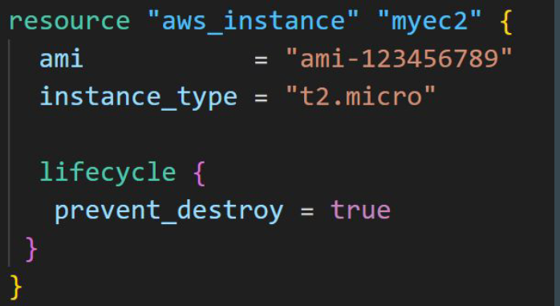

# LifeCycle - Prevent Destroy Argument

This meta-argument, when set to true, will cause Terraform to reject with an
error any plan that would destroy the infrastructure object associated with the
resource, as long as the argument remains present in the configuration.

This can be used as a measure of safety against the accidental replacement of
objects that may be costly to reproduce, such as database instances.

Since this argument must be present in configuration for the protection to apply,
note that this setting does not prevent the remote object from being destroyed if
the resource block were removed from configuration entirely.