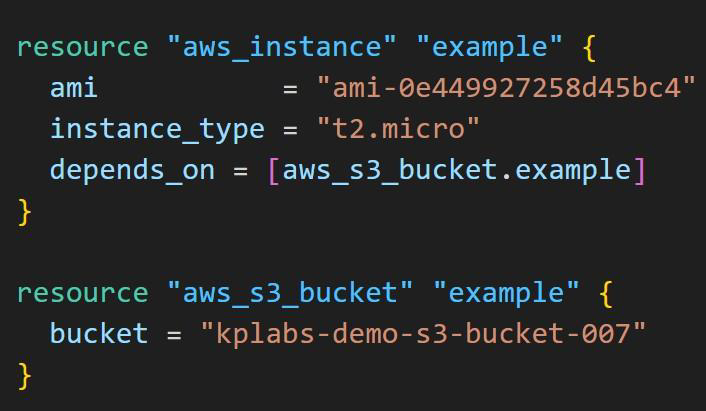
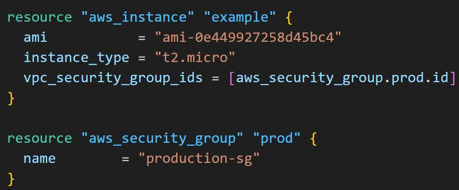

# Implicit vs Explicit Dependencies

There are two ways to define dependencies in Terraform.

## Explicit dependencies
Explicit dependencies are declared using the depends_on meta-argument.
You use this when there’s no direct attribute reference, but you still need to
control the order of resource creation.

## Sample Requirement

EC2 instance should only allow communication from trusted set of IP
addresses. Resources Needed: EC2 Instance + Security Group (Firewall)

## Introducing Implicit Dependency

Since in aws_instance resource there is a reference to the ID of the
aws_security_group resource, Terraform automatically understands that the
security group must be created before the EC2 instance.
note that Implicit Dependency is not apply for all resources.

