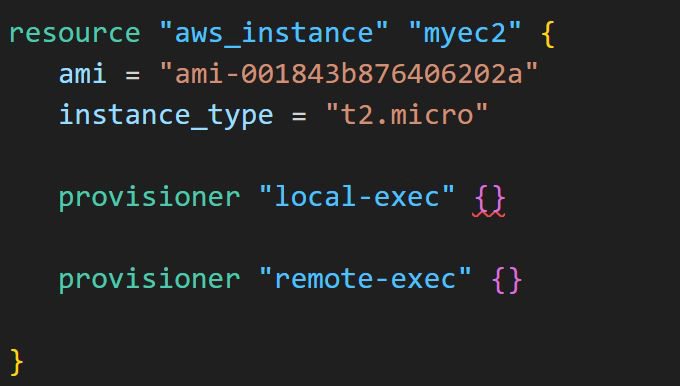
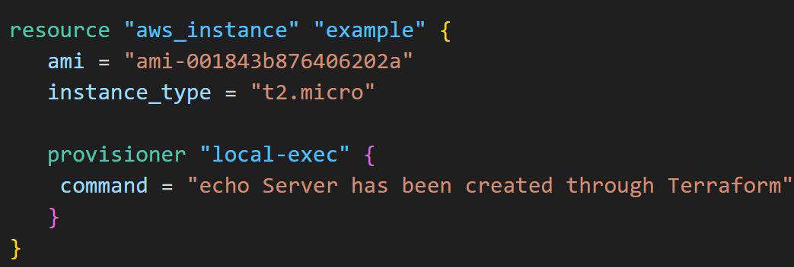

# Format of Provisioners

Provisioners are defined inside a specific resource.

## Defining provisioner
Provisioners are defined by “provisioner” followed by type of provisioner

For local provisioners, we have to specify command that needs to be run locally

Since commands are executed on remote-server, we have to provide way for
Terraform to connect to remote server.

