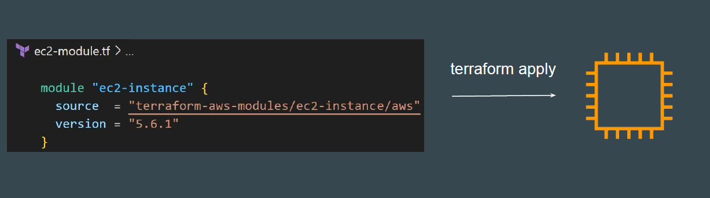
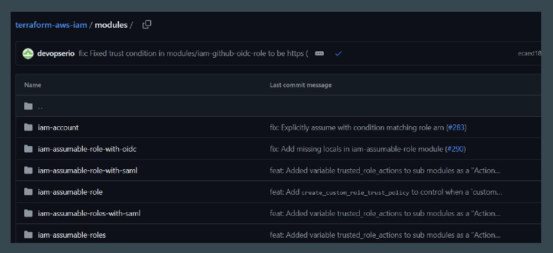

For some infrastructure resources, you can directly use the module calling code,
and the entire infrastructure will be created for you.

## Avoiding Confusion

Just by referencing any module, it is not always the case that the infrastructure
resource will be created for you directly.
Some modules require specific inputs and values from the user side to be filled
in before a resource gets created.

### Example Module - AWS EKS

If you try to use an AWS EKS Module directly and run “terraform apply”, it will
throw an error.

Some module pages in GitHub can contain multiple sets of modules together for
different features.
In such cases, you have to reference the exact sub-module required.

Always read the Module Documentation to understand the overall structure,
important information, and what is expected from the user side when creating a
resource.