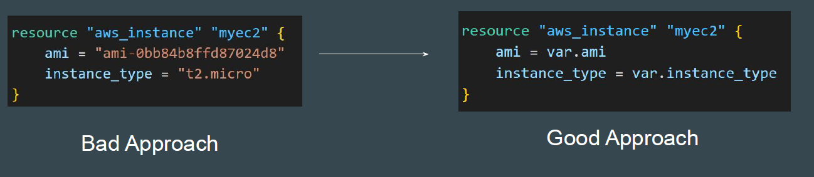

# Improvements in Custom Module Code

We had created a very simple module that allows developers to launch an EC2
instance when calling the module.


## Need to Analyze Shortcomings

Being a simplistic and a basic module code, there is a good room of
improvements.
In today’s video, we will be discussing about some of the important
shortcomings with the code.


## Challenge 1 - Hardcoded Values

The values are hardcoded as part of the module.
If developer is calling the module, he will have to stick with same values.
Developer will not be able to override the hardcoded values of the module.


## Challenge 2 - Provider Improvements

Avoid hard-coding region in the Module code as much as possible.
A required_provider block with version constraints for module to work is
important.


Documentation Referenced:

https://developer.hashicorp.com/terraform/language/providers/requirements

https://registry.terraform.io/providers/hashicorp/aws/latest/docs

Final Main Module Code:
```
terraform {
  required_providers {
    aws = {
      source  = "hashicorp/aws"
      version = ">= 5.50"
    }
  }
}

resource "aws_instance" "myec2" {
    ami = var.ami
    instance_type = var.instance_type
}


variable "ami" {}
variable "instance_type" {}

```
Final Calling Module Code

```
provider "aws" {
  region = "ap-south-1"
}

module "ec2" {
  source = "../../modules/ec2"
  instance_type = "t2.large"
  ami = "ami-123"
}
```

## Point to Note

As much as possible, avoid hardcoding values as part of the Modules.
This will make the module less flexible.


## Convert Hard Coded Values to Variables

For modules, it is especially recommended to convert hard-coded values to
variables so that it can be overridden based on user requirements.



## Advantages of Variables in Module Code

Variable based approach will allow the teams to override the values.


## Reviewing Professional EC2 Module Code

Reviewing an EC2 Module code that is professionally written, we see that the
values associated with arguments are not hardcoded and variables are used
extensively.

