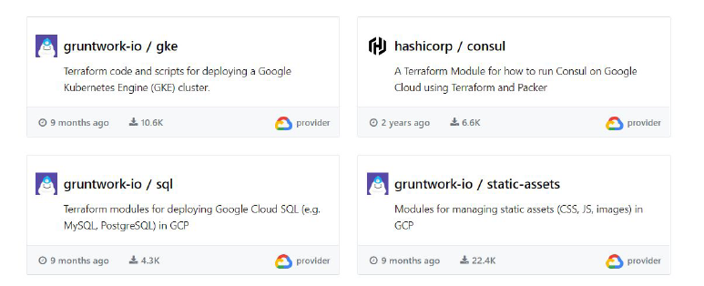
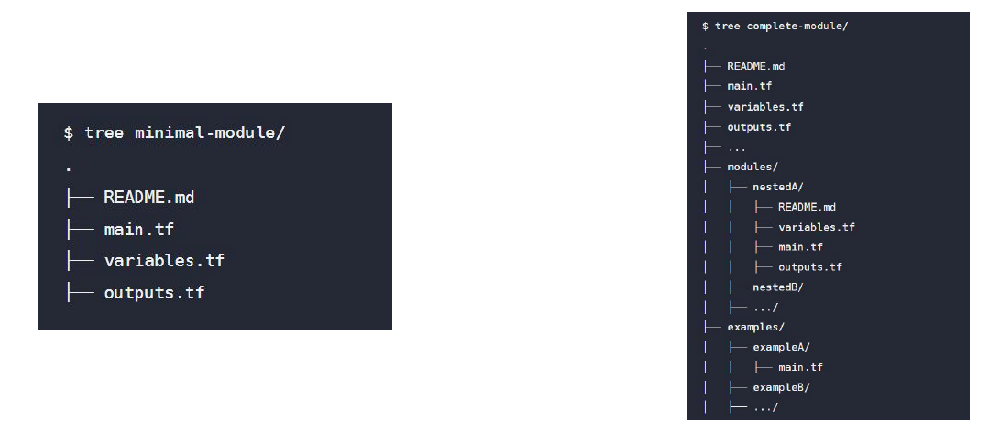

# Publishing Modules

## Overview of Publishing Modules

Anyone can publish and share modules on the Terraform Registry.
Published modules support versioning, automatically generate documentation, allow
browsing version histories, show examples and READMEs, and more.

## Requirements for Publishing Module

## Standard Module Structure

The standard module structure is a file and directory layout that is recommend for
reusable modules distributed in separate repositories.

