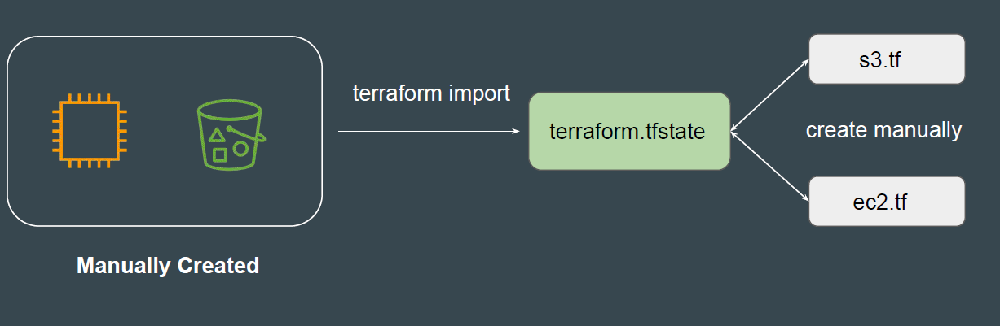

# Terraform Import

It can happen that all the resources in an organization are created manually.
Organization now wants to start using Terraform and manage these resources
via Terraform.

## Earlier Approach

In the older approach, Terraform import would create the state file associated
with the resources running in your environment.
Users still had to write the tf files from scratch.

## Newer Approach

In the newer approach, terraform import can automatically create the terraform
configuration files for the resources you want to import.

## Point to Note

*Terraform 1.5* introduces automatic code generation for imported resources.
This dramatically reduces the amount of time you need to spend writing code to
match the imported
This feature is not available in the older version of Terraform.
