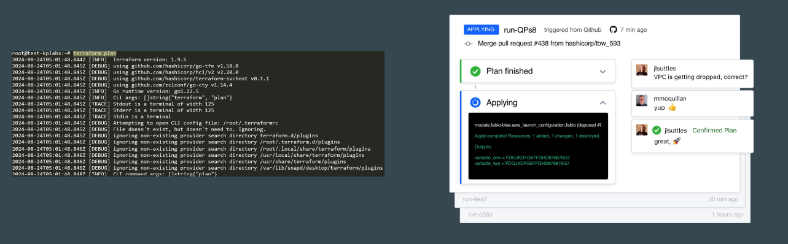

# HashiCorp Cloud Platform - Terraform

Till now, we have been managing Terraform through CLI
Although this approach is decent, we should also be aware that there is a GUI
based offering that is available.

*HCP Terraform*  manages Terraform runs in a consistent and reliable environment
with various features like access controls, private registry for sharing modules,
policy controls and others.

HCP Terraform is not entirely free. Depending on the usage and features
needed, there are multiple pricing plans that are available.

   

