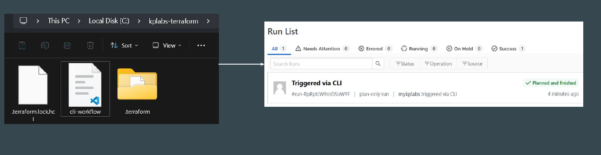

# The CLI-driven Run Workflow

Whenever we create a new Workspace in HCP, following are the 3 types of
workflow modes that are available.

In this approach, the working directory on your workstation is linked with HCP
Workspace.
The code file can be present in your laptop, and plan/apply operations can also
be initiated from local workstation.

# Step 1 - Setup Cloud Integration

You have to add code block within your .tf file to setup cloud integration.
This code will contain details about your HCP organization and workspace name.

# Step 2 - Terraform Login

Once your cloud integration code block has been added, next step is to run the
*terraform login* command.

# Step 3 - Initialize

Run the terraform init command to initialize

# Step 4 - Run the Plan / Apply Operations

Once initialized, the terraform “plan”, and “apply” commands when entered
through CLI will run in HCP Terraform with output streamlined in terminal.

