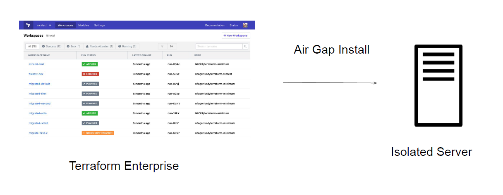
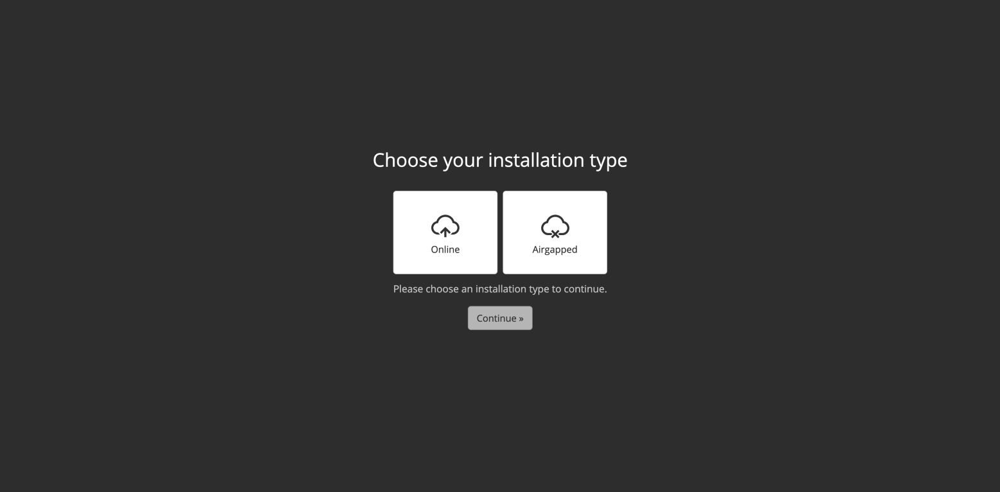
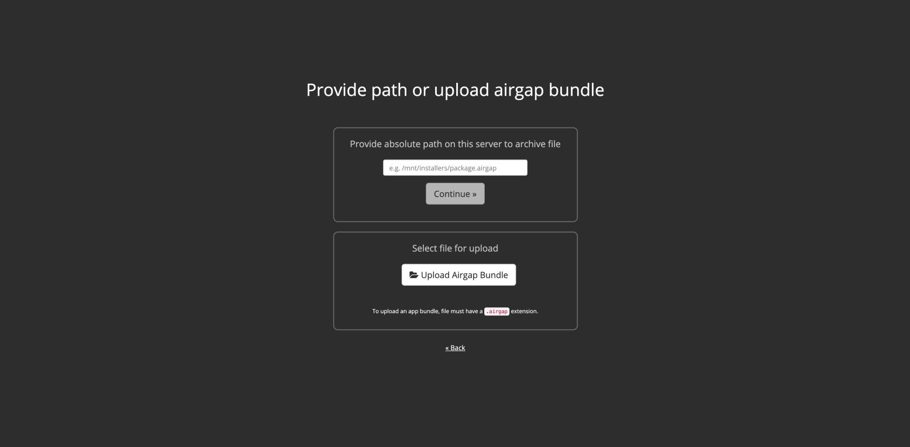

# Air Gapped Environments

## Understanding Concept of Air Gap

An air gap is a network security measure employed to ensure that a secure computer network
is physically isolated from unsecured networks, such as the public Internet.

## Usage of Air Gapped Systems

Air Gapped Environments are used in various areas. Some of these include:
● Military/governmental computer networks/systems
● Financial computer systems, such as stock exchanges
● Industrial control systems, such as SCADA in Oil & Gas fields

## Terraform Enterprise Installation Methods

Terraform Enterprise installs using either an online or air gapped method and as the
names infer, one requires internet connectivity, the other does not

