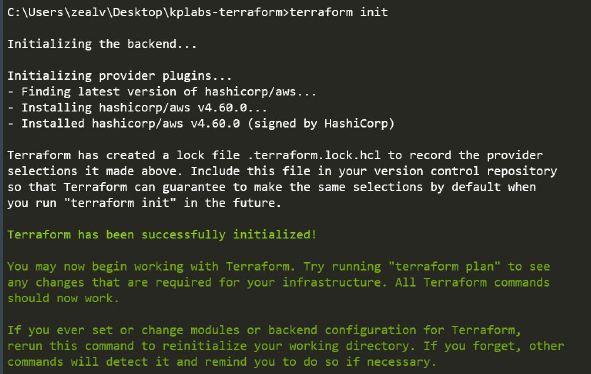
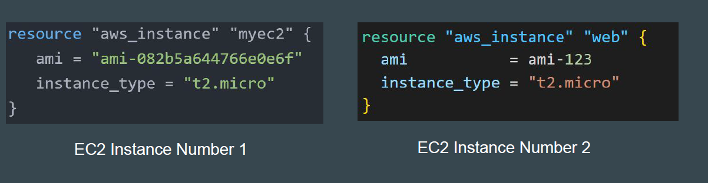
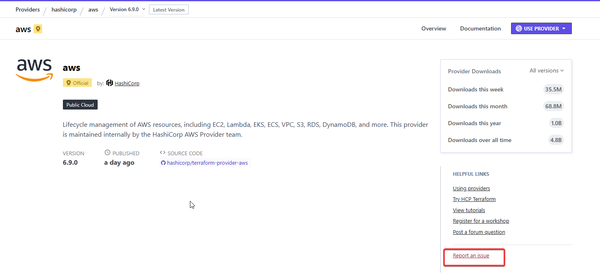

# Providers and Resources

Terraform supports multiple providers.Depending on what type of infrastructure we want to launch, we have to use
appropriate providers accordingly.

https://registry.terraform.io/browse/providers

## Provider Plugins

A provider is a plugin that lets Terraform manage an external API.
When we run terraform init, plugins required for the provider are automatically
downloaded and saved locally to a .terraform directory.

## Resource

Resource block describes one or more infrastructure objects

Examples:
- resource aws_instance
- resource aws_alb
- resource iam_user
- resource digitalocean_droplet

## Resource Blocks

A resource block declares a resource of a given type ("aws_instance") with a
given local name ("myec2").Resource type and Name together serve as an identifier for a given resource
and so must be unique.

You can only use the resource that are supported by a specific provider.
In the below example, provider of Azure is used with resource of aws_instance

The core concepts, standard syntax remains similar across all providers.
If you learn the basics, you should be able to work with all providers easily.

## Issues and Bugs with Providers

A provider that is maintained by HashiCorp does not mean it has no bugs.
It can happen that there are inconsistencies from your output and things
mentioned in documentation. You can raise issue at Provider page.

