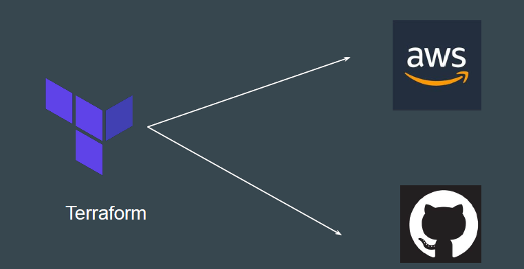
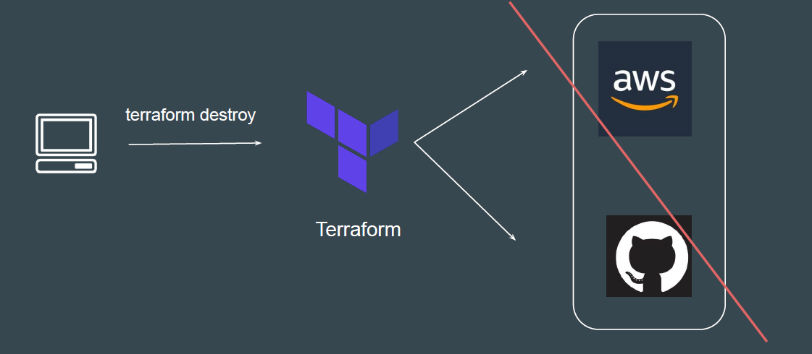
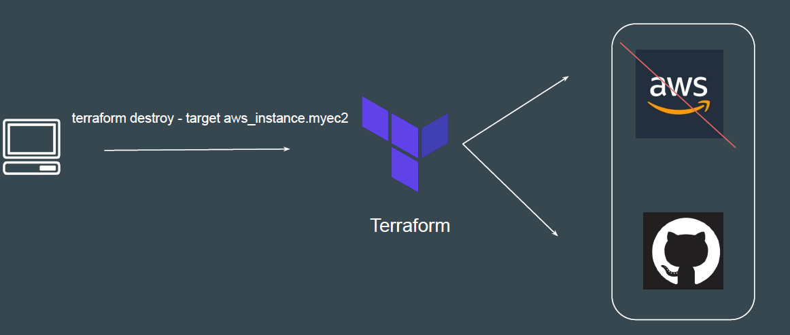
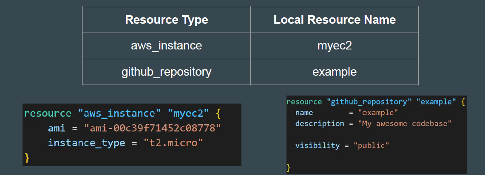

# Learning to Destroy Resources

If you keep the infrastructure running, you will get charged for it.
Hence it is important for us to also know on how we can delete the infrastructure
resources created via terraform.

## Destroy ALL
terraform destroy allows us to destroy all the resource that are created within the
folder.

## Destroy Some

terraform destroy with *-target* flag allows us to destroy specific resource.

## Terraform Destroy with Target

The -target option can be used to focus Terraform's attention on only a subset of
resources.
Combination of : Resource Type + Local Resource Name

