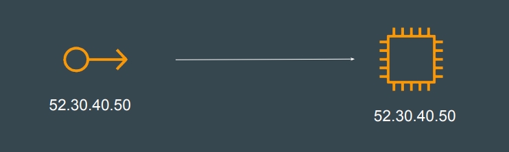

# Basics of Elastic IP in AWS

An Elastic IP address is a static IPv4 address in AWS.
You can create it and associate it with EC2 instance.
We are going to use Terraform to generate Elastic IP resource in AWS.




## Documentation Referred:

https://registry.terraform.io/providers/hashicorp/aws/latest/docs/resources/eip

### eip.tf

```sh
resource "aws_eip" "lb" {
  domain   = "vpc"
}
```

### Commands Used:
```sh
terraform apply -auto-approve
terraform destroy -auto-approve
```