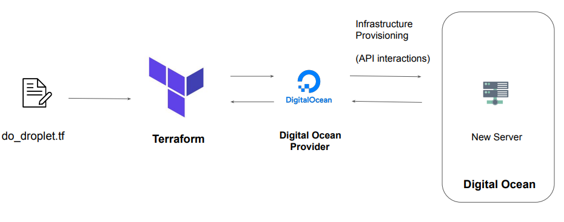

# Provider Version challenge  

## Provider Architecture

## Overview of Provider Versioning

Provider plugins are released separately from Terraform itself.
They have different set of version numbers.

## Explicitly Setting Provider Version

During terraform init, if version argument is not specified, the most recent provider will be
downloaded during initialization.
For production use, you should constrain the acceptable provider versions via configuration, to
ensure that new versions with breaking changes will not be automatically installed.

## Arguments for Specifying provider

There are multiple ways for specifying the version of a provider.

| Version Number Arguments  | Description |
|---------------------------|-------------|
| >=1.0 | Greater than equal to the version|
| <=1.0 | Less than equal to the version|
| ~>2.0 | Any version in the 2.X range|
| >=2.10,<=2.30  | Any version between 2.10 and 2.30|

## Dependency Lock File
Terraform dependency lock file allows us to lock to a specific version of the provider.
If a particular provider already has a selection recorded in the lock file, Terraform will always
re-select that version for installation, even if a newer version has become available.
You can override that behavior by adding the -upgrade option when you run terraform init.

