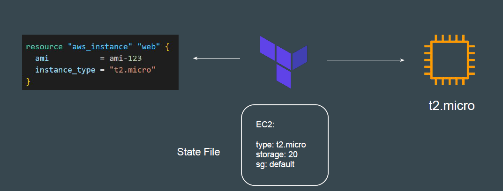
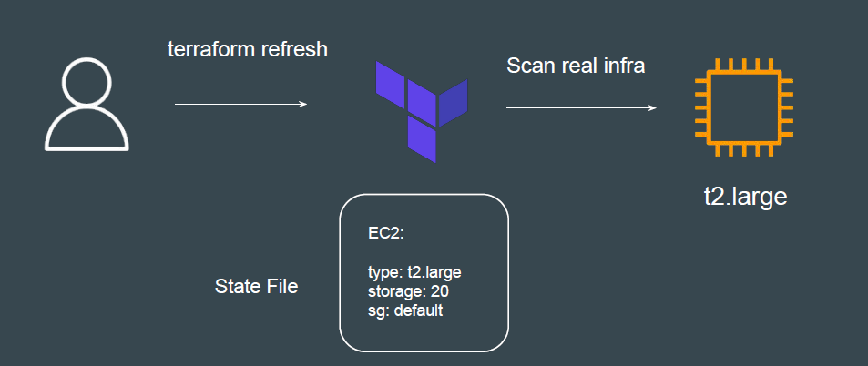

# Terraform Refresh

## Understanding the Challenge

Terraform can create an infrastructure based on configuration you specified.
It can happen that the infrastructure gets modified manually.

The terraform refresh command will check the latest state of your infrastructure
and update the state file accordingly.

You shouldn't typically need to use this command, because Terraform
automatically performs the same refreshing actions as a part of creating a plan
in both the terraform plan and terraform apply commands.
The terraform refresh command is deprecated in newer version of terraform.
The -refresh-only option for terraform plan and terraform apply was introduced in
Terraform v0.15.4.