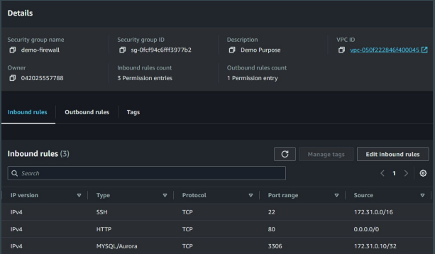

# Basic of Firewalls

## Basic of Ports
A port acts as a endpoint of communication to identify a given application or
process on an Linux operating system

## Basic of FireWall

Firewall is a network security system that monitors and controls incoming and
outgoing network traffic based on predetermined security rules.

## Firewall in AWS

A security group acts as a virtual firewall for your instance to control inbound and
outbound traffic.

## Sample Security Group with Rules

## Inbound and Outbound Rules

Firewalls control both inbound and outbound connections to and from the server.

### Documentation Referred:

https://registry.terraform.io/providers/hashicorp/aws/latest/docs/resources/security_group