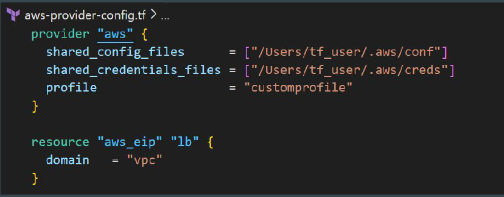

# AWS Provider - Authentication Configuration

At this stage, we have been manually hardcoding the access / secret keys within
the provider block.
Although a working solution, but it is not optimal from security point of view.

We want our code to run successfully without hardcoding the secrets in the
provider block.

The AWS Provider can source credentials and other settings from the shared
configuration and credentials files.

If shared files lines are not added to provider block, by default, Terraform will
locate these files at $HOME/.aws/config and $HOME/.aws/credentials on Linux
and macOS.
"%USERPROFILE%\.aws\config" and "%USERPROFILE%\.aws\credentials" on
Windows.

## AWS CLI
AWS CLI allows customers to manage AWS resources directly from CLI.
When you configure Access/Secret keys in AWS CLI, the location in which these
credentials are stored is the same default location that Terraform searches the
credentials from.

