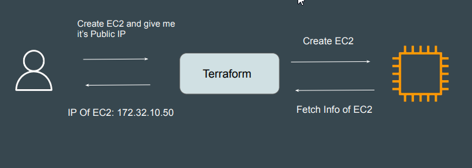

# What is Output value?
Output values make information about your infrastructure available on the
command line, and can expose information for other Terraform configurations to
use.

## Sample example use case

Create a Elastic IP (Public IP) resource in AWS and output the value of the EIP.

## Point to note
Output values defined in Project A can be referenced from code in Project B as
well.

## Terraform Output
The terraform output command is used to extract the value of an output variable from the state
file.

