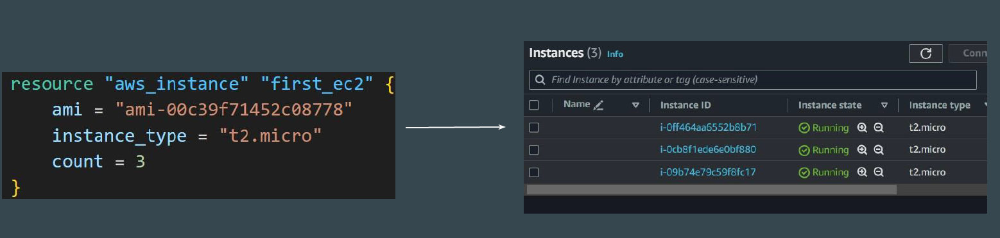
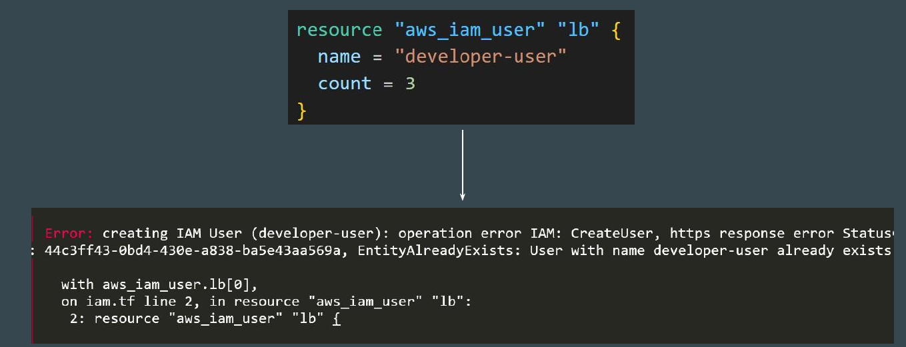

# The COUNT Meta-Argument

By default, a resource block configures one real infrastructure object.


# Understanding the Use-case scenario
sometimes you want to manage several similar objects ( like a fixed pool of compute instances) without a separate block for each one.


## Introducing Count Argument
The count argument accepts a whole number, and creates that many instance of the resource.
[The count Meta-Argument](https://developer.hashicorp.com/terraform/language/meta-arguments/count)


## Basic code
```
resource "aws_instance" "server" {
  count = 4 # create four similar EC2 instances

  ami           = "ami-a1b2c3d4"
  instance_type = "t2.micro"

  tags = {
    Name = "Server ${count.index}"
  }
}
```

## Challenges with count
The instances created through count and identical copies, but you might want to customize certain properties for each one.



For many resources, exact identical copies are not required and will not work.

**Example** : You can not have multiple AWS USers with exact same name.




