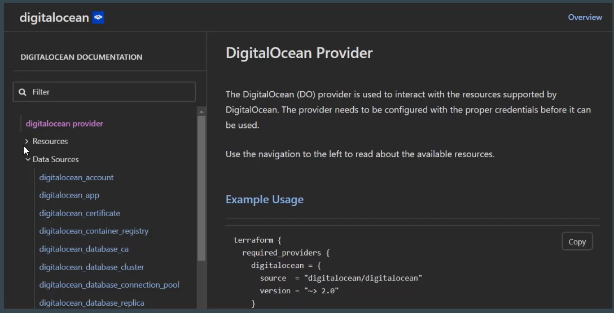
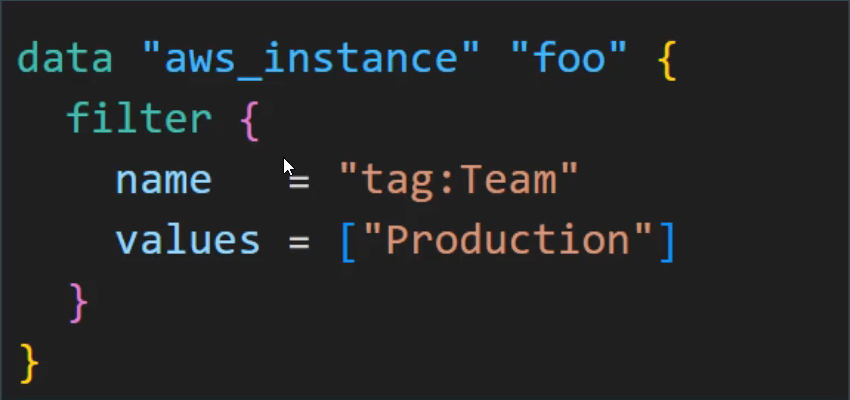

# Introducing Data Sources
Data sources allow Terraform to use /fetch information defined outside of Terraform.


## Example 1- Reading Info of Digital Ocean account
Following data source code is used to get information on your Digital Ocean account.

```
data "digitalocean_account" "example"{}

```
## Example 2- Reading file
Following data source allow you to read content of a file in your local filesystem.

```
data "local_file" "foo"{
    filename = "${PATH.module}/demo.txt"
}
```
"${PATH.module}" returns the current file system path where your code is located.

## Example 3- Fetch the Ec2 instance details
Following data source code is used to fetch detail about EC2 instance in your AWS region.

```
data "aws_instance" "example" {}

```

## Finding available Data Source
List of available datasource are associated with each resource of provider.



## Understanding the Basic Structure
a data source is accessed via a special kind of resource known as a data resource, declared using a data block.

Following data block requested that Terraform read from a given data source
("data_instance) and exports the result under the given local name ("foo")

```
data "aws_instance" "example" {}

```
## Filter Structure
Within the block body (between {and}) are query constraint defined by the data source.



You have been given a requirement to write a Terraform code that creates EC2
instance using latest image of Amazon Linux.
Steps that we typically follow:
1-GO to EC2 Console
2-Fetch the latest AMI ID
3-Add that AMI ID in Terraform code.


Hardcoding static details in your Terraform code lead you to repeatedly modify your code to meat changing requirements.
In many of the cases, the static value changes depending on the region.
Example: AMI IDs are specific to region.
Hardcoded AMI in code will only work for single region.


We want Terraform to automatically query latest OS image in AWS or any other provide and use that for creating server.
We need code which works for all region without modification.


Data sources allow Terraform to use information defined outside of Terraform
and we can use that information to provision resources.

