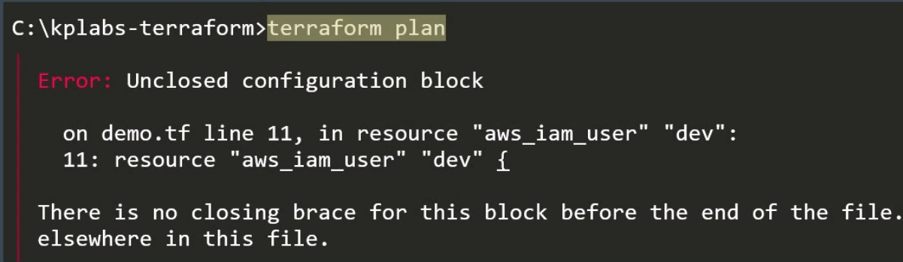
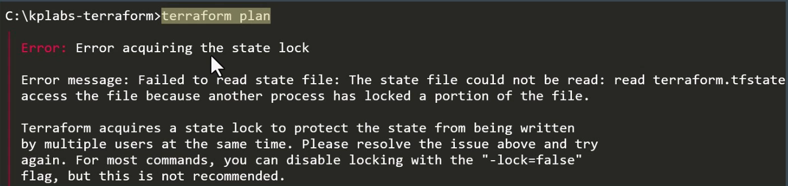

# Debugging Terraform
Similar to SSH VErbosity, even Terraform allows us to set wide variety of log levels for getting detailed logs for debugging purpose.
Terraform has detailed logs that you can enable by setting by the **TF_LOG** environment variable to any value.
You can set TF_LOG to one of the log levels (in order of decreasing verbosity).

|log level|
|---------|
| TRACE   |
| DEBUG   |
| INFO    |
| WARN    |
| ERROR   |

## Storing the Logs to file
to persist logged output you can set **TF_LOG_PATH** in order to force the log to always be appended to a specific when logging is enabled.

```
#in windows
set TF_LOG=[log level]
set TF_LOG_PATH=terraform.txt

#in Linux
export TF_LOG=[log level]
export TF_LOG_PATH=terraform.log

```

## Terraform Troubleshooting Model
There are four potential types of issues that you could experience with Terraform.
+ Language
+ State
+ Core
+ Provider Errors


## Language Errors
In most of the cases, the errors that you will face be related to this.
when Terraform encounters a syntax error in your configuration, it prints out the line numbers and an explanation of the error.



## State Errors
In state out of sync, Terraform may destroy or change your existing resources.
if state locked, you will also be blocked from running write operations.



## Core errors
These errors are directly related to the main Terraform application.
Errors produced at this level may be bug.


## Provider errors
These set of errors are primarily related to the provider plugins.
Use the Provider GitHub page for reporting and identifying the issue.

