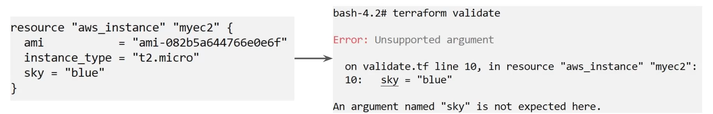

# OverView of Terraform Validate
Terraform Validate primarily checks whether configuration is syntactically valid. it checks various aspects including unsupported arguments, undeclared variables and others. 
when you run "Terraform Plan" validation will automatically run based on your code.

