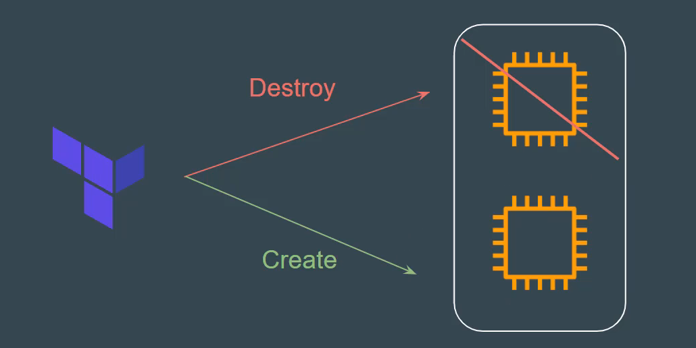

# Understanding the USe-Case
you have created a new resource via Terraform.
Users have made a lot of manual changes (both infrastructure and inside the server)
 Tow ways to deal with this:
 - Import Changes to Terraform
 - Delete & recreate the resources

 

 # Recreating the resource
 the "-replace" option with Terraform apply to force Terraform to replace an object even there are no configuration changes that would require it.

 ```
 terraform apply -replace="aws-instance.web"

 ```
 

 ## Pints to note
 Similar kind of functionality was achieved using terraform taint command in older versions of Terraform.
  For Terraform v.15.2 and later, HahiCorp recommend using the -replcae option with terraform apply