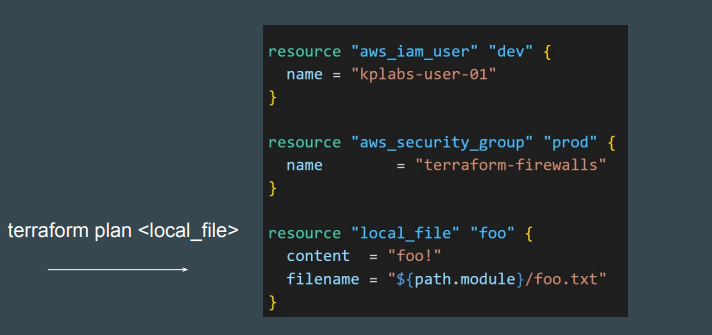

# Resource targeting 
In a typical Terraform workflow, you apply the entire plan at once. This is also the
default behavior.

## Understanding Resource Targeting

Resource targeting in Terraform allows you to apply changes to a specific subset
of resources rather than applying changes to your entire infrastructure.

## Using the -target flag

You can use Terraform's -target option to target specific resources, modules as
part of operation.

## Use-Cases

A project has 10 resources. Multiple team members are working on each
resource’s Terraform code to release some updates.

When you run terraform plan, you see Terraform trying to make changes to all
10 resources.

There is a critical issue and you need to add a port 80 in security group that is
managed via terraform without having to update other 9 resources.

## Points to Note

Occasionally you may want to apply only part of a plan, such as when
Terraform's state has become out of sync with your resources due to a network
failure, a problem with the upstream cloud platform, or a bug in Terraform or its
providers. 

To support this, Terraform lets you target specific resources when you plan,
apply, or destroy your infrastructure.

Targeting individual resources can be useful for troubleshooting errors, **but
should not be part of your normal workflow.**