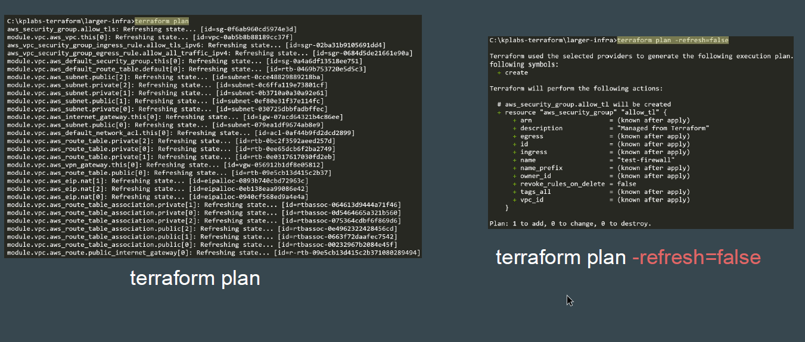

# Dealing with Larger Infrastructure

##  Cloud does not mean Unlimited
Using a Cloud provider does not mean you have access to unlimited resources.
There are some limits that apply to all of the services.
When you’re architecting for the cloud, you need to keep API throttling in mind,
particularly the types of calls and the frequency with which they are called.
When the allotted rate limit for an API call is exceeded, you’ll receive an error
response and the call will be throttled.

## Key Consideration in Terraform
When a single project has large set of resources that are managed, even a
simple terraform plan can lead to higher number of API calls to the provider.

Whenever you are designing Terraform projects, you have to take in mind the
API limits of the provider to avoid throttling that will further impact production
systems.

## Convert Big Project to Multiple Smaller Project

Whenever you are designing Terraform projects, you have to take in mind the
API limits of the provider to avoid throttling that will further impact production
systems.

## Use Resource Targeting

Using resource targeting, the number of calls that will be made to a provider will
be much less.

## Setting refresh=false

The *-refresh=false* option is used in normal planning mode to skip the default
behavior of refreshing Terraform state before checking for configuration
changes.
By disabling automatic refresh, you can potentially speed up the planning and
application process, especially if you're confident that the existing state is
accurate.

