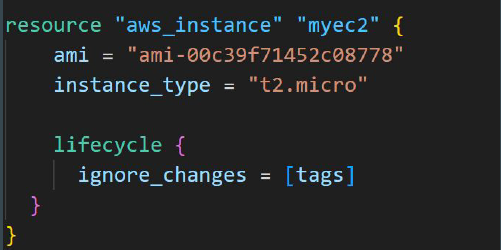

# LifeCycle - Ignore Changes Argument

In cases where settings of a remote object is modified by processes outside of
Terraform, the Terraform would attempt to "fix" on the next run.
In order to change this behavior and ignore the manually applied change, we
can make use of ignore_changes argument under lifecycle.

Instead of a list, the special keyword all may be used to instruct Terraform to
ignore all attributes, which means that Terraform can create and destroy the
remote object but will never propose updates to it.

