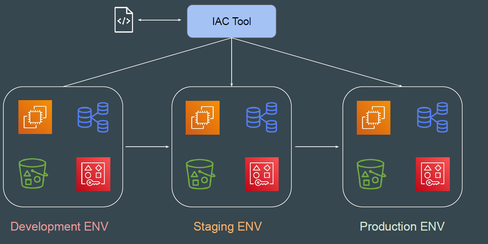
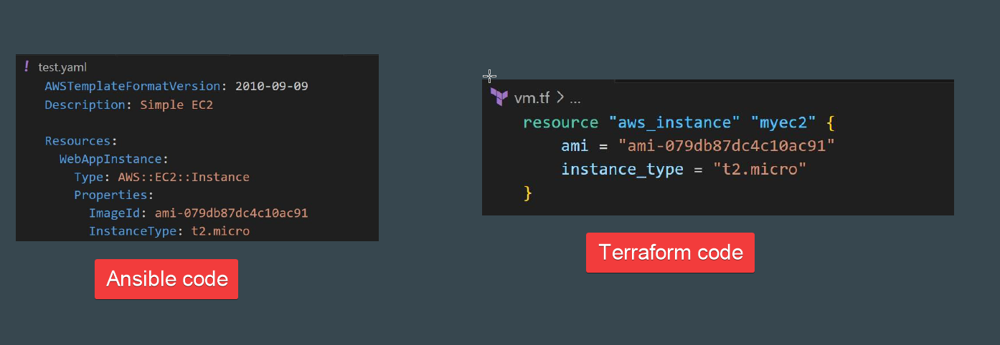
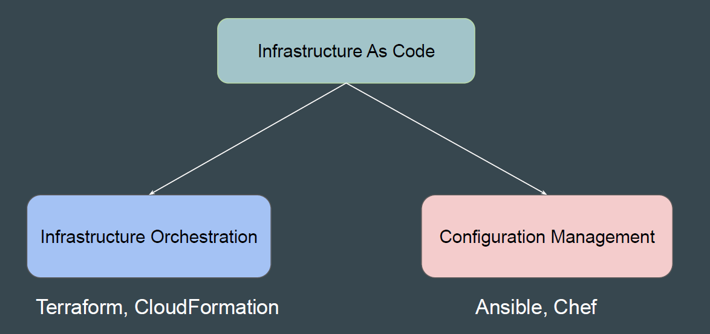
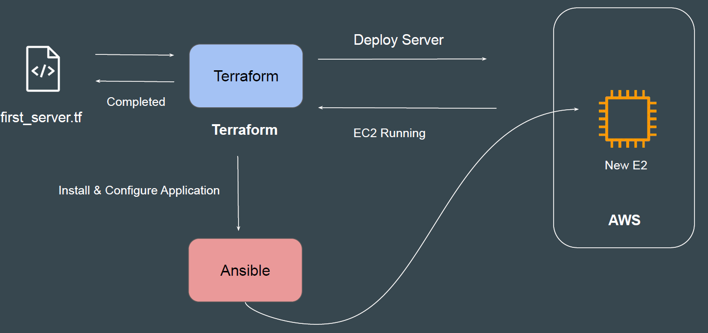

# Understanding the Basics

There are two ways in which you can create and manage your infrastructure:
1- Manually approach.
2- Through Automation

## example 1 - Database Backup

I was assigned a task to take database backup every day at 10 PM and the
backup had to be stored in Amazon S3 Storage with appropriate timestamp.

- db-backup-01-01-2024.sql
- db-backup-02-01-2024.sql

Initially due to lack of time, I used to manually take DB backup at 10 PM and
upload it to S3.

If a particular task has to be done in an repeatable manner, it MUST be
automated.

- Depending on the type of task, the tools for automation will change.
- There are wide variety of Tools & Technologies used for Automation like Ansible, CloudFormation, Terraform, Python etc.

## example 2 - Create Single service in diffrent enviroment 

If we want to create set of resources (Virtual Machine, Database, S3, AWS Users)
with exact similar configuration in Dev, Stage and Production environment.

Infrastructure as Code (IaC) is the managing and provisioning of infrastructure
through code instead of through manual processes.

## Benefits of Infrastructure As Code

There are several benefits of designing your infrastructure as code:

- Speed of Infrastructure Management.
- Low Risk of Human Errors.
- Version Control.
- Easy collaboration between Teams.

# Choosing Right IAC Tool

There are various types of tools that can allow you to deploy infrastructure as
code :

- Terraform
- CloudFormation (AWS)
- Heat (OpenStack)
- Ansible
- ARM (Azure)
- Bicep (Azure)
- Chef, Puppet

## Categories of Tools

The tools are widely divided into two major categories

## Configuration Management

Configuration Management tools are primarily used to maintain desired
configuration of systems (inside servers)
Example: ALL servers should have Antivirus installed with version 10.0.2

## Infrastructure Orchestration

Infrastructure Orchestration is primarily used to create and manage
infrastructure environments.
Example: Create 3 Servers with 4 GB RAM, 2 vCPUs. Each server should have
firewall rule to allow SSH connection from Office IPs.

## IAC & Configuration Management = Friends

## How to choose IAC Tool?

- Is your infrastructure going to be vendor specific in longer term ? Example AWS.
- Are you planning to have multi-cloud / hybrid cloud based infrastructure ?
- How well does it integrate with configuration management tools ?
- Price and Support

## Use-Case 1 - Requirement of Organization 1

- Organization is going to be based on AWS for next 25 years.
- Official support is required in-case if team face any issue related to IAC tool or
  code itself.
- They want some kind of GUI interface that supports automatic code
  generation.

## Use-Case 2 - Requirement of Organization 2

- Organization is based on Hybrid Solution. They use VMware for on-premise
setup; AWS, Azure and GCP for Cloud.

- Official support is required in-case if IAC tool has any issues.