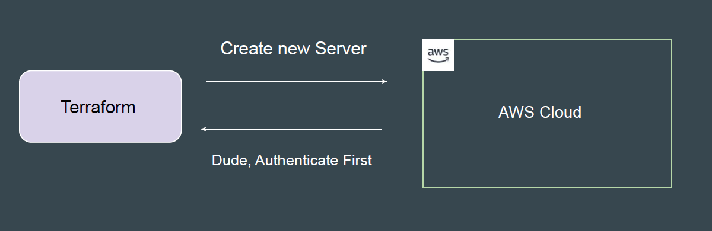
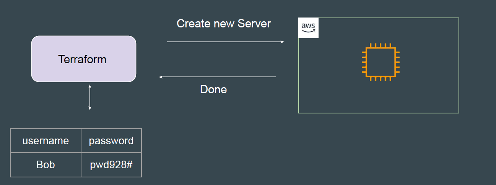
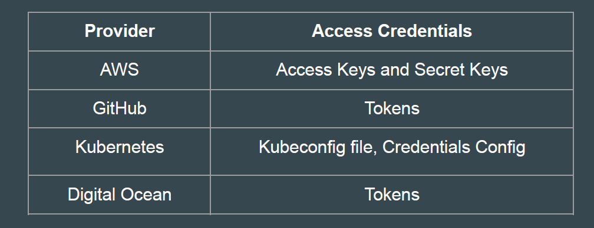

## Create a new AWS Account.

## Authentication and Authorization
Before we start working on managing environments through Terraform, the first
important step is related to Authentication and Authorization.

Authentication is the process of verifying who a user is.
Authorization is the process of verifying what they have access to

Example:
Alice is a user in AWS with no access to any service.
Terraform needs access credentials with relevant permissions to create and
manage the environments.

Depending on the provider, the type of access credentials would change.

