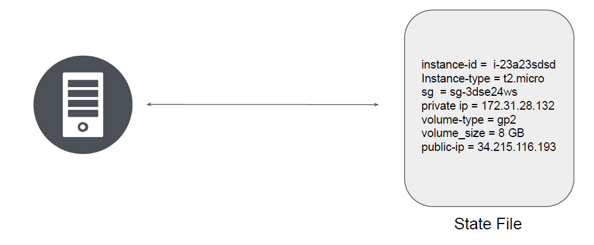
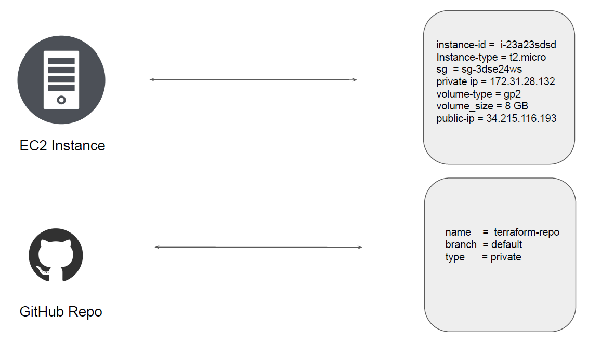
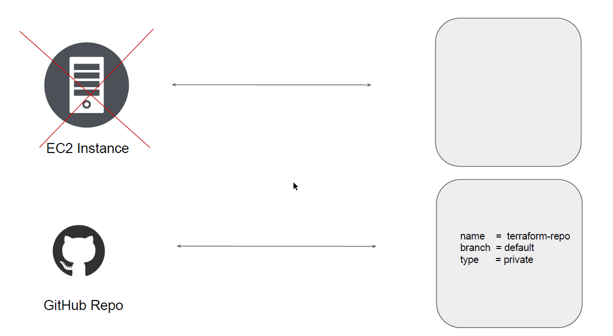
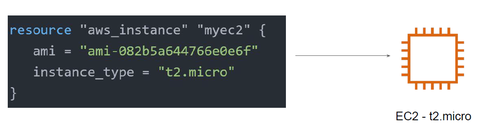
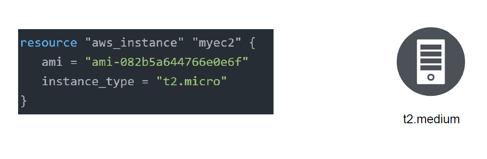

# Terraform State File

Terraform stores the state of the infrastructure that is being created from the TF files.
This state allows terraform to map real world resource to your existing configuration.

# Desired & Current State

## Desired State

Terraform's primary function is to create, modify, and destroy infrastructure resources to
match the desired state described in a Terraform configuration

## Current State
Current state is the actual state of a resource that is currently deployed.

Terraform tries to ensure that the deployed infrastructure is based on the desired state.
If there is a difference between the two, terraform plan presents a description of the
changes necessary to achieve the desired state.