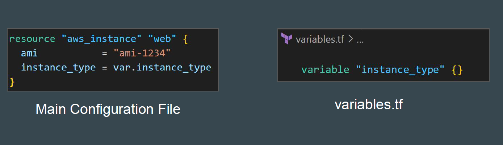
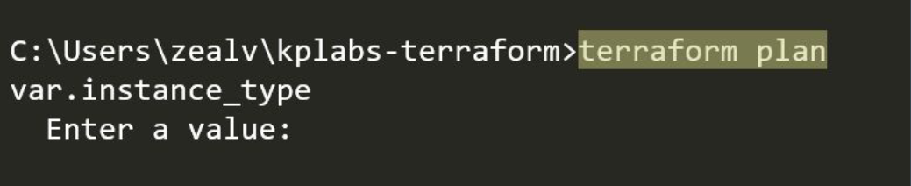
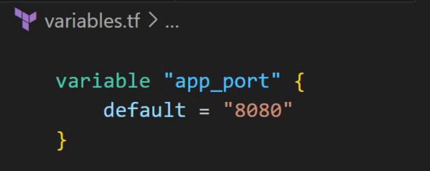
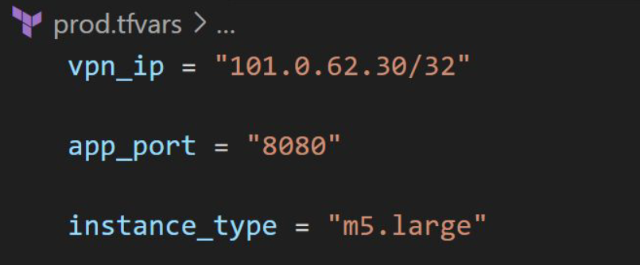
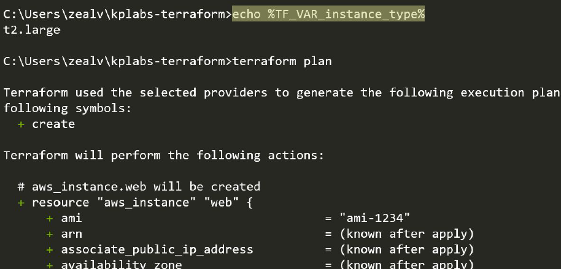

# Approach to Variable Assignment

By default, whenever you define a variable, you must also set a value
associated with it.

If you have not defined a value for a variable, Terraform will ask you to input the
value in CLI Prompt when you run terraform plan / apply operation.

## Declaring Variable Values

When variables are declared in your configuration, they can be set in a number
of ways:

- Variable Defaults.
- Variable Definition File (*.tfvars)
- Environment Variables
- Setting Variables in the Command Line.

### Variable Defaults

You can set a default value for a variable.
If there is no value supplied, the default value will be taken.

### Variable Definition File (*.tfvars)

Variable Values can be defined in *.tfvars file.

### Setting Variable in Command Line

To specify individual variables on the command line, use the -var option when
running the terraform plan and terraform apply commands.

### Setting Variable through Environment Variables

Terraform searches the environment of its own process for environment
variables named *TF_VAR_* followed by the name of a declared variable.

