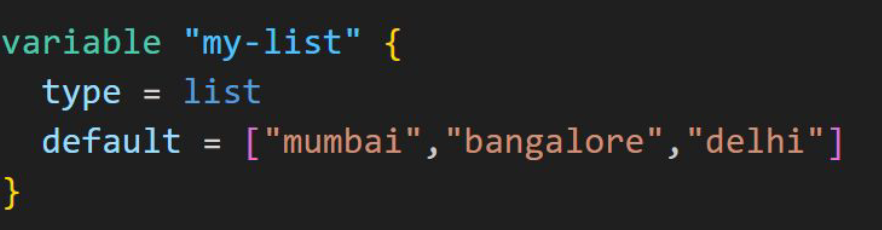
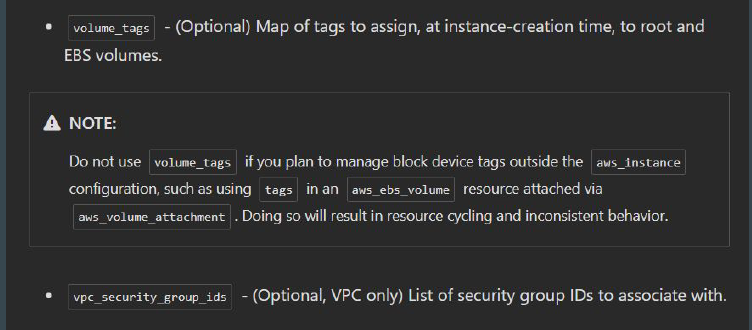
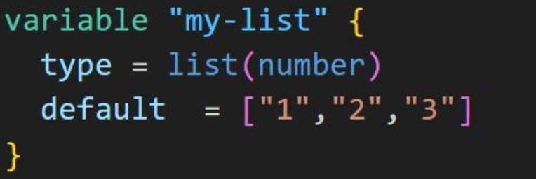

# Data Type - List

Allows us to store collection of values for a single variable / argument.
Represented by a pair of square brackets containing a comma-separated
sequence of values, like ["a", 15, true].
Useful when multiple values needs to be added for a specific argument

## Data Type and Documentation

Arguments for a resource requires specific data types.
Some argument requires list, some requires map and so on.
The details of data type expected for an argument is mentioned in
documentation.

## Use-Case 1: List Data Type

EC2 instance can have one or more security groups.
Requirement:
Create EC2 instance with 2 security groups attached.

## Specify the Type of Values in List

We can also specify the type of values expected in a list.

