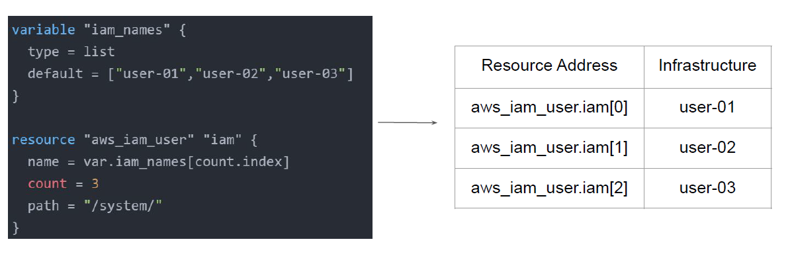
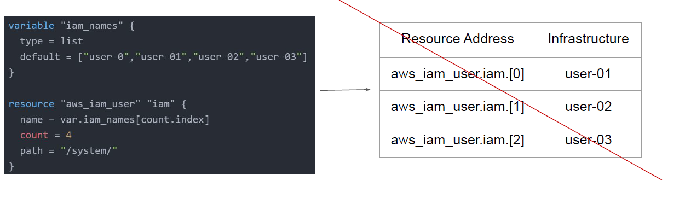
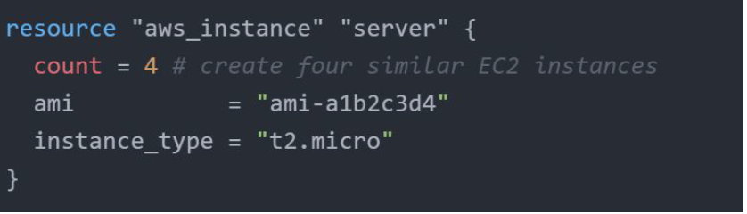

# Challenges with Count Meta-Argument

Resource are identified by the index value from the list.

If the order of elements of index is changed, this can impact all of the other resources.

If your resources are almost identical, count is appropriate.
If distinctive values are needed in the arguments, usage of for_each is recommended.

