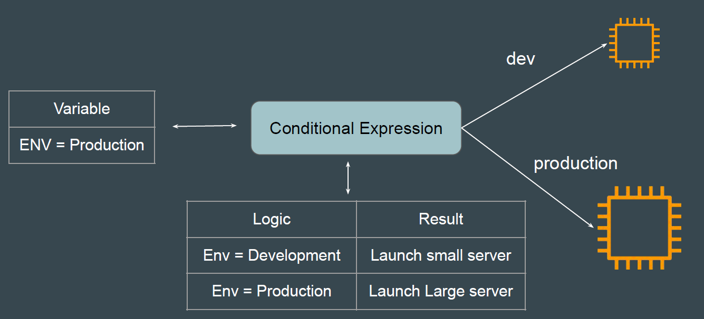
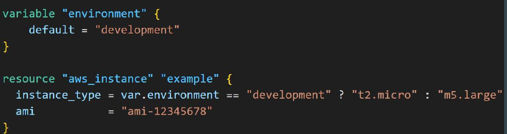
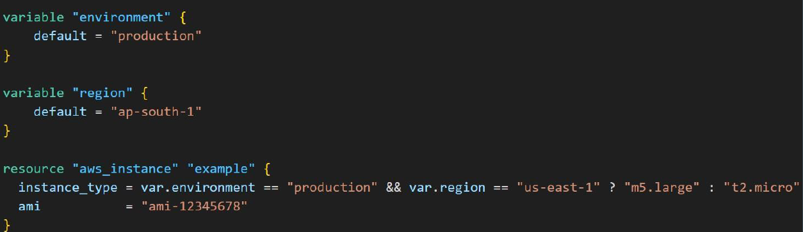

# Conditional Expression
Conditional expressions in Terraform allow you to choose between two values based on a condition.



the syntax of a conditional expression is as follows:
 
 **Conditions? true_val:false_val**

 if condition is true then the result is true_val. if condition is false then the result is false_val

 **Example**

 If environment is Development "t2.micro" instance type should be used.

 If environment is not development, "m5.large" instance type should be use.


 

 ```
 variable "environment" {
    default = "development"
 }

 resource "aws_instance" "example" {
    instance_type = var.environment == "development" ? "t2.micro" : "m5.large" 
    ami = "ami-12345678"
 }

 ```
 if the following example, only if env= production and region = us-east-1, the larger instance type of m5.large cab be used.
 



 ```
 variable "environment" {
    default = "development"
 }

  variable "region" {
    default = "us-east-1"
   
 }

 resource "aws_instance" "example" {
    ami = "ami-0100e595e1cc1ff7f"
    instance_type = var.environment == "development" && var.region == "us-east-1" ? "t2.micro" : "m5.large" 
   
 }

 ```