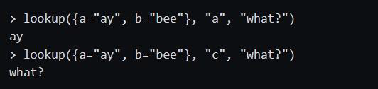
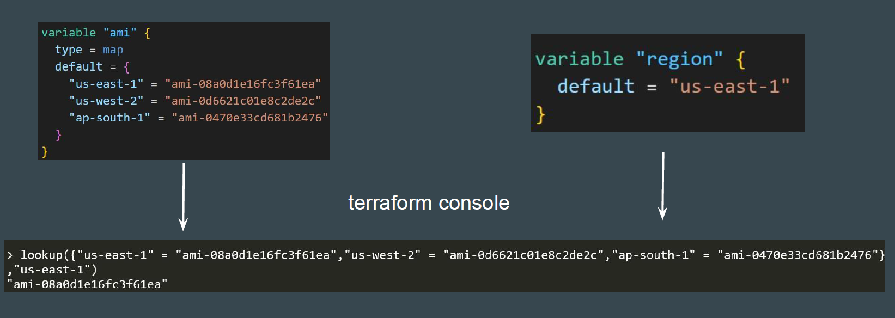
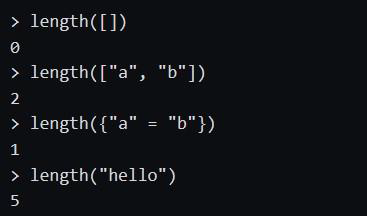
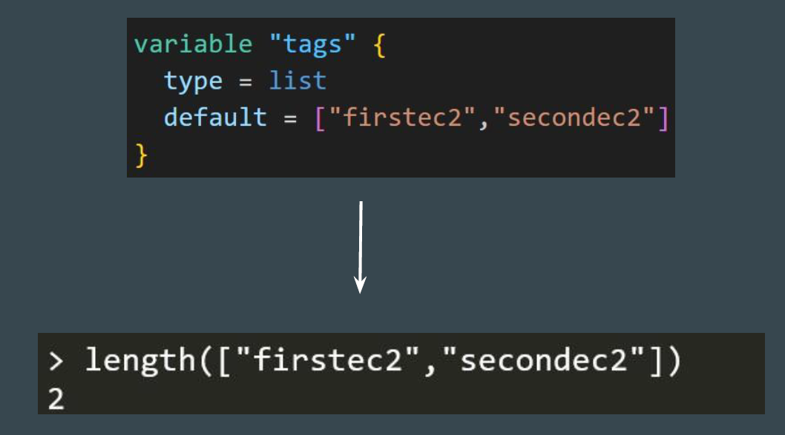
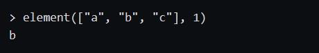
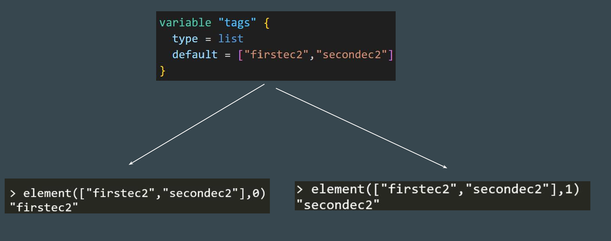
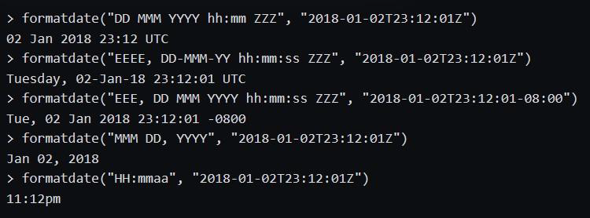
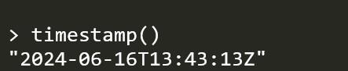
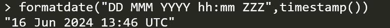

## Analyzing Lookup Function
lookup retrieves the value of a single element from a map, given its key.
Format: lookup(map, key, default)
n.



### Testing Lookup Function

To test lookup function, add the details that are part of the map associated with
variable of ami and the default value of variable of regio



[Terraform Lookup function](https://developer.hashicorp.com/terraform/language/functions/lookup)

## Analyzing Length Function
length determines the length of a given list, map, or string.



### Testing Length Function

Code: count = length(var.tags)



[Terraform Length function](https://developer.hashicorp.com/terraform/language/functions/length)

## Analyzing Element Function
element retrieves a single element from a list.
Format: element(list, index)



### Testing Element Function
Code: Name = element(var.tags,count.index)



[Terraform element function](https://developer.hashicorp.com/terraform/language/functions/element)


## Analyzing TimeStamp Function
timestamp returns a UTC timestamp string in RFC 3339 format.



[Terraform timestamp Function](https://developer.hashicorp.com/terraform/language/functions/timestamp)

### Testing TimeDate Function
A simple call to the timestamp () returns the timestamp value



## Analyzing Formatdate Function
formatdate converts a timestamp into a different time format.


Code Block:

```
CreationDate = formatdate("DD MMM YYYY hh:mm ZZZ",timestamp())

```


[ Terraform formatdate Function](https://developer.hashicorp.com/terraform/language/functions/formatdate)