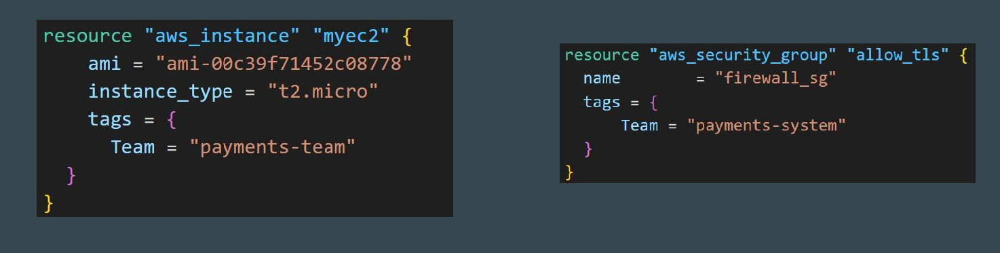
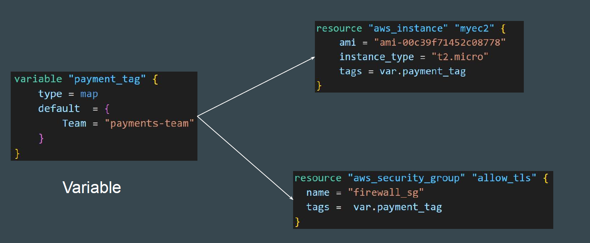
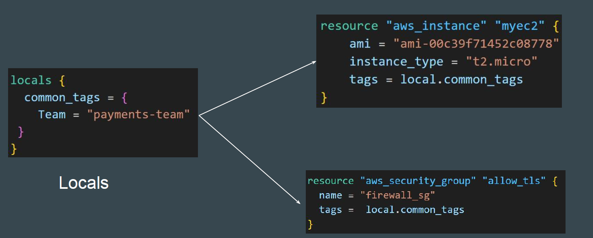
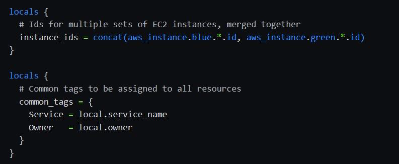

# Understanding the challenge
Various resources in your project can have common values like tags.
Repeating these values across multiple resources blocks increase the code length and makes it difficult to mange in larger projects.



one solutions is to centralize these common values using Variables.



Local values are similar to Variables in a sense that it allows you to store data centrally and that can be references in ,multiple parts of configuration.



## additional Benefit of locals 
You can add expression to locals, which allows you to compute values dynamically and use functions with locals.



## Importance Points to Note
Variable value can be defined in wide variety of place like terraform.tfvars, ENV Variables, CLI and so on.
Locals are more of private resources. You have to directly modify the code.
locals are used when you want to avoid repeating the same expression multiple times.
local values are often referred to as just "locals".
local values are create by locals block (plural), but you reference them as attribute on an object names local(singular)

### Documentation Referred:

https://developer.hashicorp.com/terraform/language/functions/formatdate

### Base Code of local-values.tf

```sh
resource "aws_security_group" "sg_01" {
  name = "app_firewall"
  tags = {
    Name = "security-team"
  }
}

resource "aws_security_group" "sg_02" {
  name = "db_firewall"
  tags = {
    Name = "security-team"
  }
}

```

### Final Code

```sh
variable "tags" {
  type = map
  default = {
    Team = "security-team"
  }
}

locals {
  default = {
    Team = "security-teams"
    CreationDate = "date-${formatdate("DDMMYYYY",timestamp())}"
  }
}

resource "aws_security_group" "sg_01" {
  name = "app_firewall"
  tags = local.default
}

resource "aws_security_group" "sg_02" {
  name = "db_firewall"
  tags = local.default
}
```
