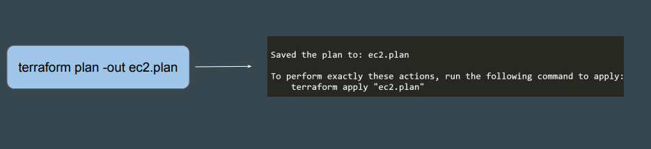
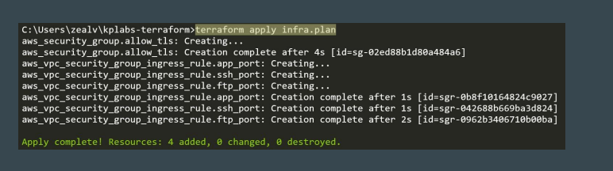
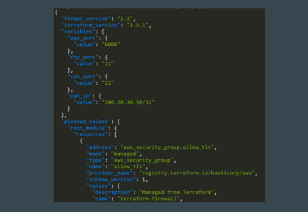

## Setting the Base
Terraform allows saving a plan to a file.

## Apply from Plan File
You can run the terraform apply by referencing the plan file.
This ensures the infrastructure state remains exactly as shown in the plan to
ensure consistency

## Use-Cases of Saving Plan to a File
Many organizations require documented proof of planned changes before
implementation. 
These changes will further be reviewed and approved.
Running apply from plan ensures consistent desired outcome.

## Exploring Terraform Plan File

The saved Terraform plan file will be a binary file.
You can use the terraform show command to read the contents in detail.
you can also see output in json form (it is recommended  use "jq" for better output)

## Use-Cases of Saving Plan to a File

Many organizations require documented proof of planned changes before
implementation.
These changes will further be reviewed and approved.
Running apply from plan ensures consistent desired outcome.

## more information and review

https://www.env0.com/blog/terraform-plan