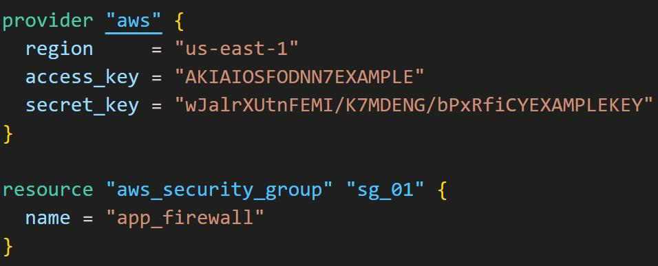
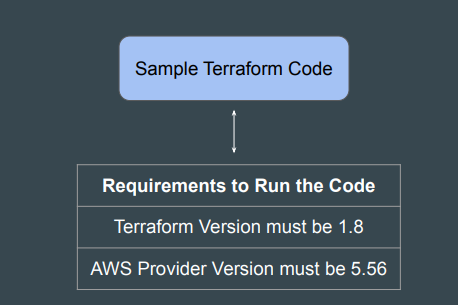
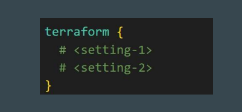
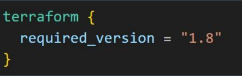
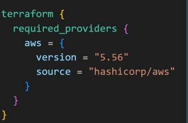
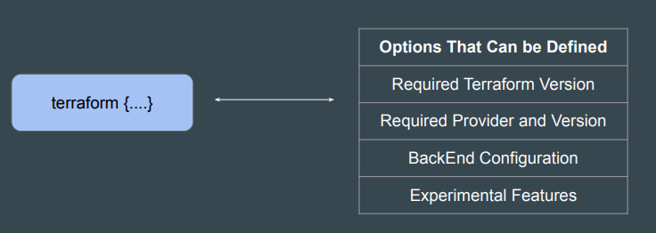

# Terraform setting
We can use the provider block to define various aspects of the provider, like
region, credentials and so on.

In a Terraform project, your code might require a very specific set of versions to
run.

Terraform Settings are used to configure project-specific Terraform behaviors,
such as requiring a minimum Terraform version to apply to your configuration.
Terraform settings are gathered together into terraform blocks:

If your code is compatible with specific versions of Terraform, you can use the
required_version block to add your constraints.

The required_providers block can be used to specify all of the providers required
by your Terraform code.
You can further fine-tune to include a specific version of the provider plugins.

There are a wide variety of options that can be specified in the Terraform block.

### Documentation Referenced:

https://registry.terraform.io/providers/hashicorp/aws/latest

https://developer.hashicorp.com/terraform/language/settings