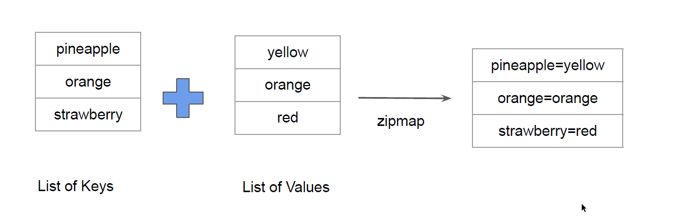
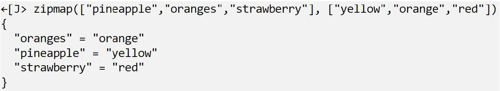
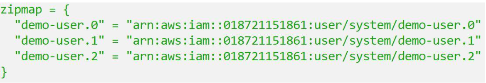

## Overview of Zipmap

The zipmap function constructs a map from a list of keys and a corresponding list of
values.

# Sample Output of Zipmap Function

# Simple Use-Case

You are creating multiple IAM users.
You need output which contains direct mapping of IAM names and ARNs

### Documentation Referred:

https://developer.hashicorp.com/terraform/language/functions/zipmap