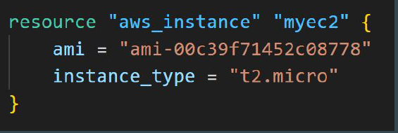
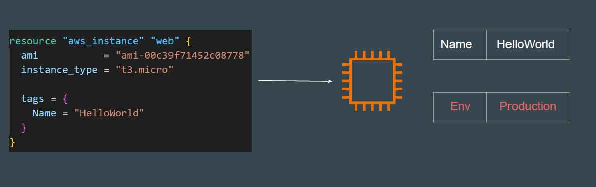
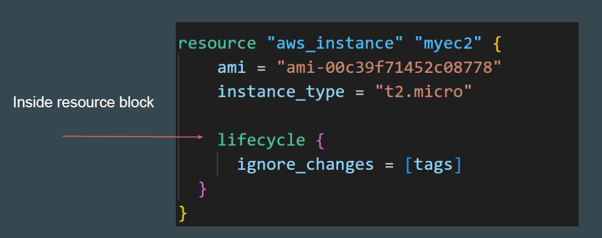
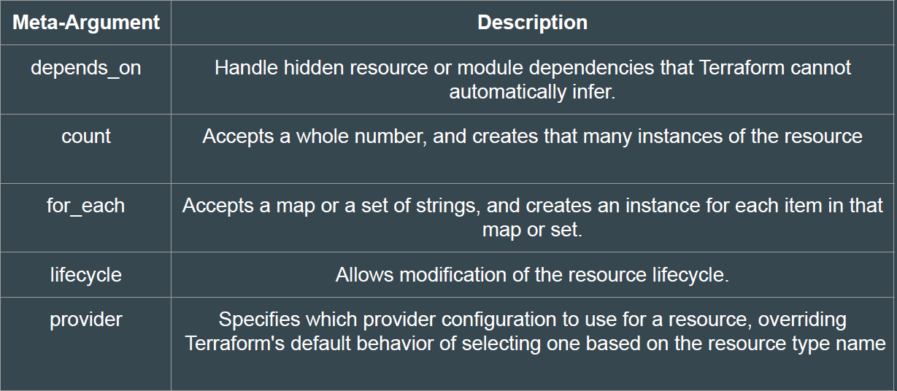

## Understanding the Basics

A resource block declares that you want a particular infrastructure object to exist
with the given settings

## How Terraform Applies a Configuration

Create resources that exist in the configuration but are not associated with a real
infrastructure object in the state.

Destroy resources that exist in the state but no longer exist in the configuration.

Update in-place resources whose arguments have changed.
Example: change the name of EC2 in terraform state file

Destroy and re-create resources whose arguments have changed but which
cannot be updated in-place due to remote API limitations.
Example: change the AMI-id of machine for example from Linux AMI to Windows AMI

# Understanding the Limitations

What happens if we want to change the default behavior?
Example: Some modification happened in Real Infrastructure object that is not
part of Terraform but you want to ignore those changes during terraform apply.

## Solution - Using Meta Arguments

Terraform allows us to include *meta-argument* within the resource block which
allows some details of this standard resource behavior to be customized on a
per-resource basis.

## Different Meta-Arguments

