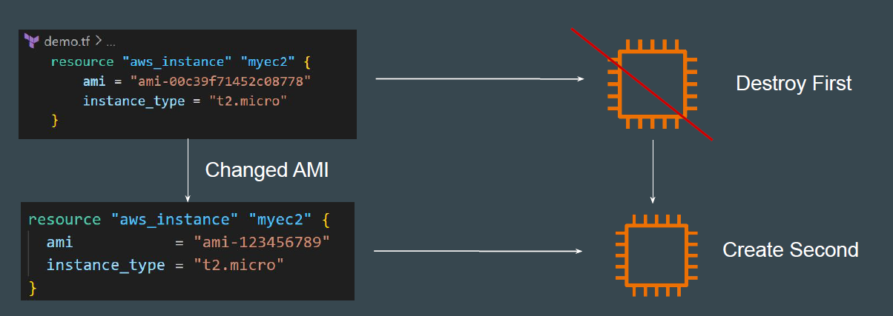
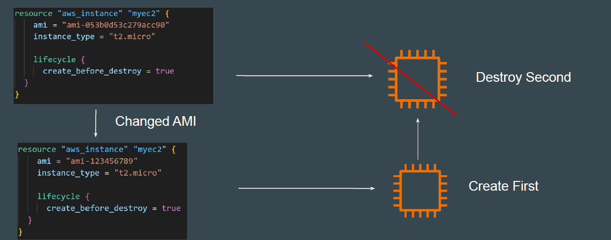

# Create Before Destroy Argument

## Understanding the Default Behavior

By default, when Terraform must change a resource argument that cannot be
updated in-place due to remote API limitations, Terraform will instead destroy the
existing object and then create a new replacement object with the new
configured arguments.

## Create Before Destroy Argument

The *create_before_destroy* meta-argument changes this behavior so that the
new replacement object is created first, and the prior object is destroyed after
the replacement is created.

