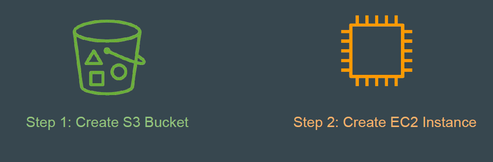
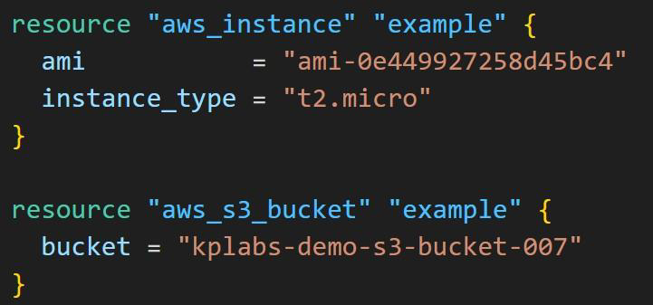
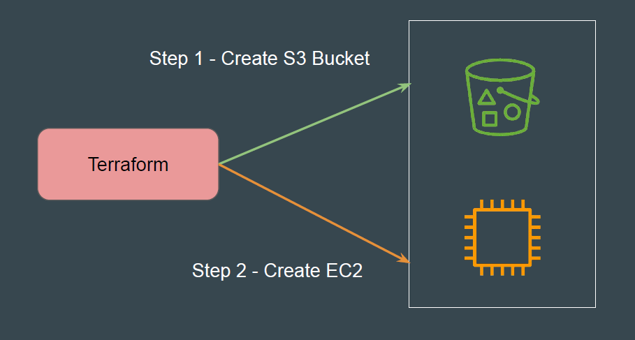
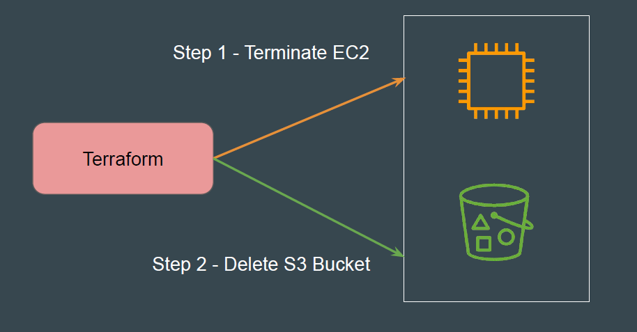

# Resource Dependencies

## Sample Requirement

An application deployed on an EC2 instance must store its data in external
storage before it can initialize.Resources Needed: S3 Bucket (for external storage) and EC2 Instance

## Understanding the Challenge

In a scenario where resources are defined independently, there is no guaranteed
order stating which resource will be created first.
Sometimes the EC2 instance may be created first, and sometimes the S3 bucket
may be created first.

## Introducing depends_on Meta Argument

The depends_on meta-argument instructs Terraform to complete all actions on
the dependency object before performing actions on the object declaring the
dependency.

## Order of Creation

The depends_on meta-argument explicitly tells Terraform that the
aws_instance.example must be created after aws_s3_bucket.example.

## Order of Deletion

When you run terraform destroy, the order is reversed to ensure dependencies
are not broken during deletion.

