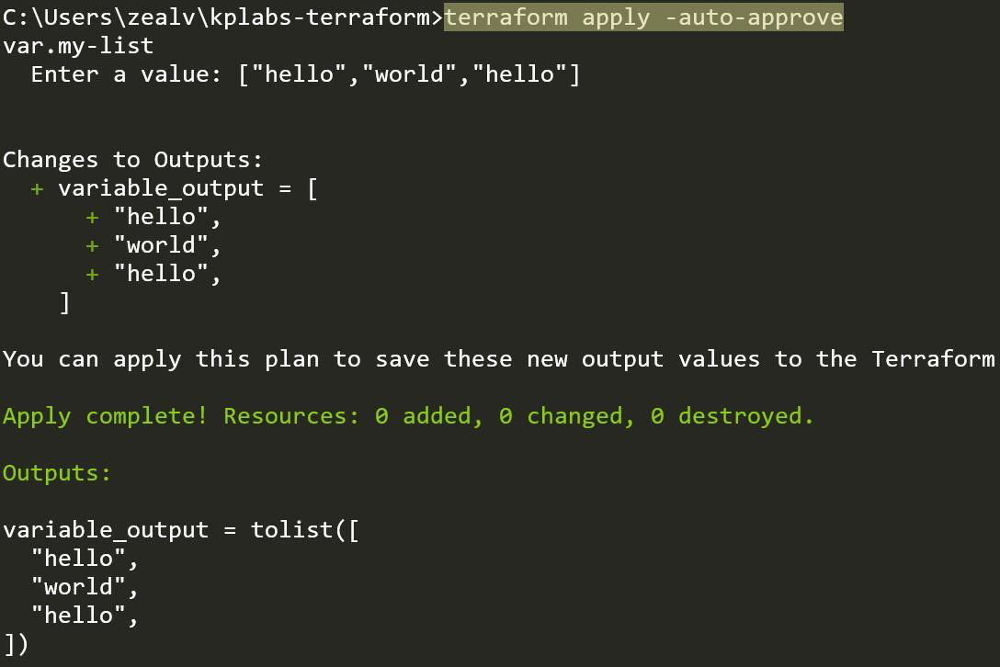
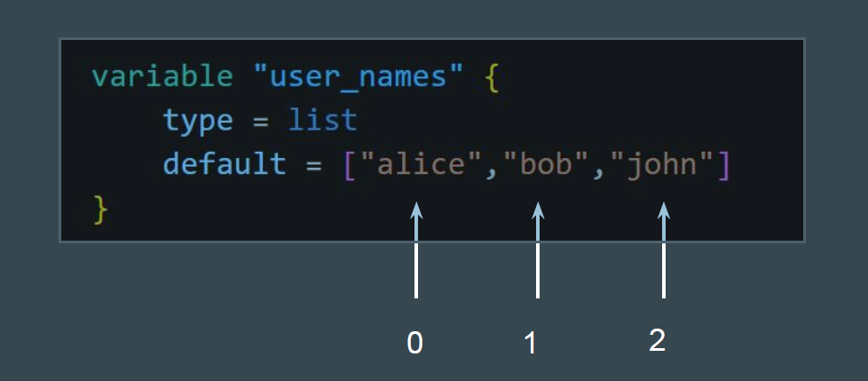
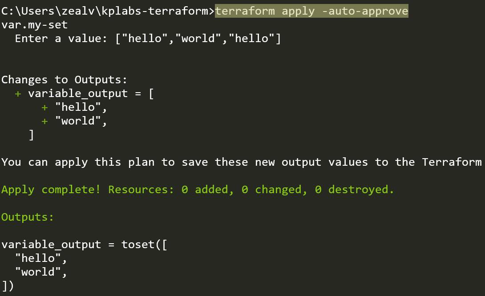
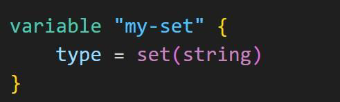
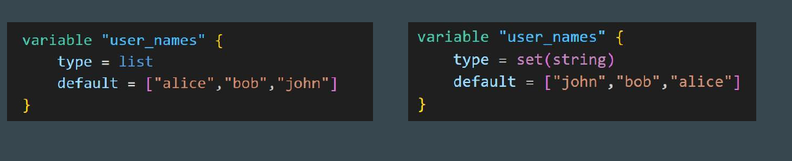

# SET - Data Type

## Revising List Data Type

Lists are used to store multiple items in a single variable.
These items can be duplicates as well.

## List and Index

List items are indexed, the first item has index [0], the second item has index [1] etc.

## SET Data Type

Sets can only store unique elements. Any duplicates are automatically removed.

While defining a SET, you need to also define the type of value that is expected.

A set does not store the order of the elements.
Terraform only tracks the presence of elements, not their order.
If the elements in a set change order, Terraform won’t detect that as a change.
However, if an element is added or removed, Terraform will apply updates
accordingly.

