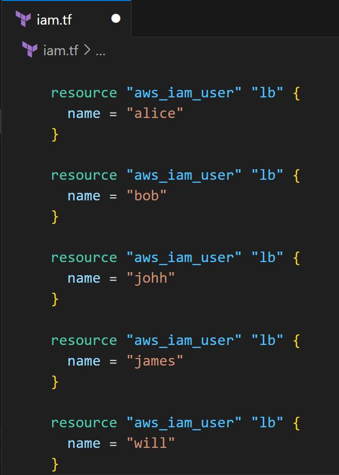
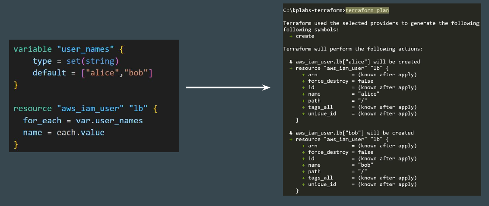
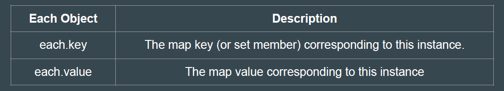
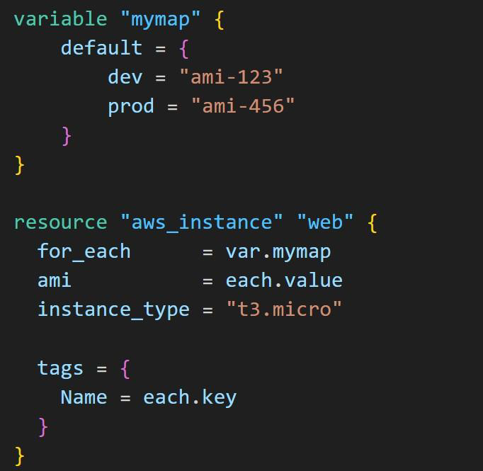

# The for_each Meta-Argument

By default, a resource block configures one real infrastructure object.
However, sometimes you want to manage several similar objects (like a fixed
pool of compute instances) without writing a separate block for each one.
Terraform has two ways to do this: count and for_each.

If we want to create multiple resources with different configuration, we have to
add multiple different resource blocks.

## Introducing for_each

If a resource block includes a for_each meta argument whose value is a map or
a set of strings, Terraform creates one instance for each member of that map or
set.

## Point to Note

In blocks where for_each is set, an additional each object is available.
These object has two attributes:

## Example - for_each with Map

When for_each is used with map, we can make use of each object to extract
both key and value from the given map.

