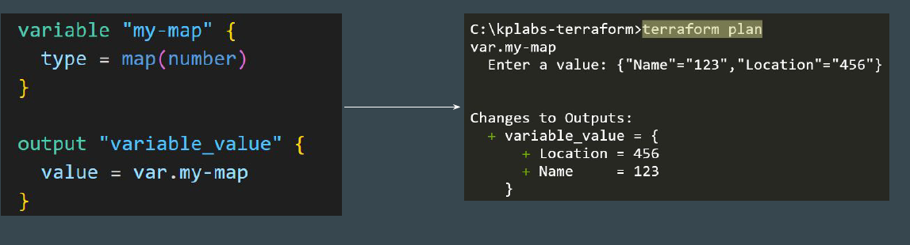
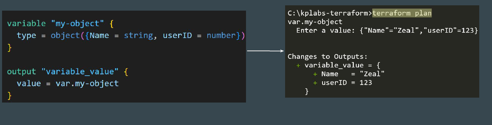
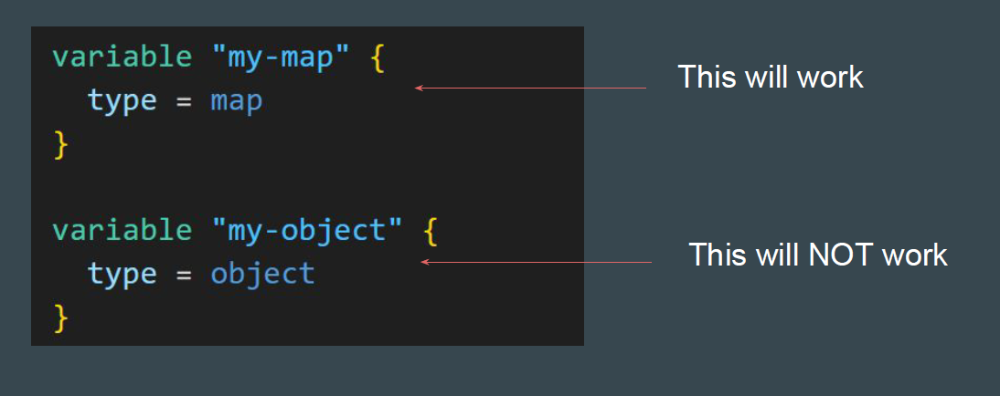
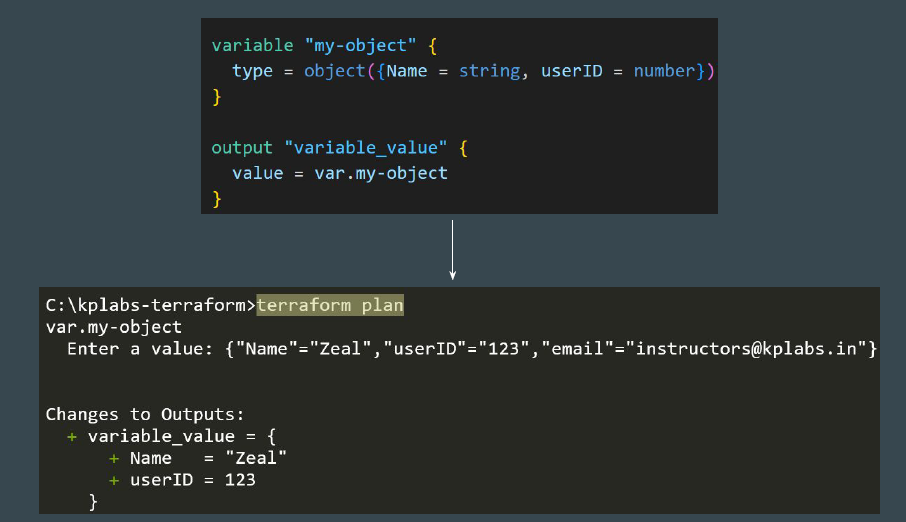

# Data Type - Object

## Revising Map Data Type

In a basic setup, a map is a collection of key-value pairs where all values must
be of the same type whereas keys are string.
Strict structure is not required explicitly.

## Introducing Object Data Type

An object is also a collection of key-value pairs, but each value can be of a
different type.
A proper structure is generally required while defining object data type.

## Proper Structure is Required

It is important to have a structure of attributes allowed as part of the object.

## Keep in Mind the Syntax

Obejct a collection of named attributes that each have their own type.
The schema for object types is { KEY = TYPE, KEY = TYPE, ... } — a
pair of curly braces containing a comma-separated series of KEY = TYPE
pairs.Extra attributes are discarded during type conversion.

## Example - Extra Attributes Provided

In the following example, an additional key=value pair is provided that is not part
of the object structure. We see on how it gets discarded in the output.

