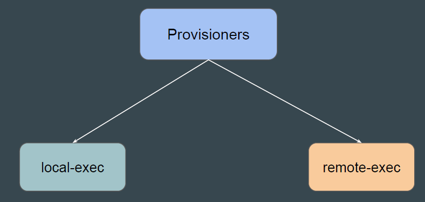
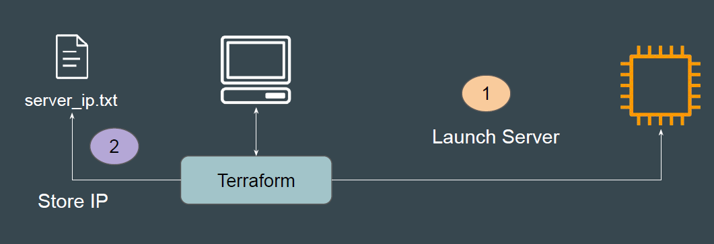
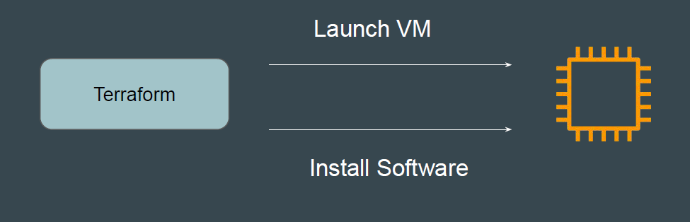
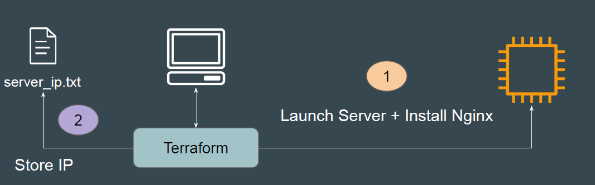

# Types of Provisioners in Terraform

Provisioners are used to execute scripts on a local or remote machine as part
of resource creation or destruction.
There are 2 major types of provisioners available

## Type 1 - local-exec provisioner

The local-exec provisioner invokes a local executable after a resource is
created.
Example: After EC2 is launched, fetch the IP and store it in file server_ip.txt

## Type 2 - remote-exec provisioner

remote-exec provisioners allow to invoke scripts or run commands directly on
the remote server.
Example: After EC2 is launched, install “apache” software

### Demo

1. Remote-Exec will install Nginx software in EC2 to have basic website.
2. Local-Exec will fetch the Public IP of EC2 and store it in a new file.

