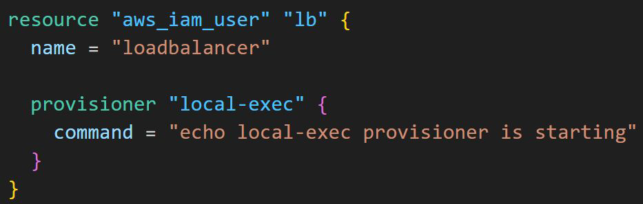
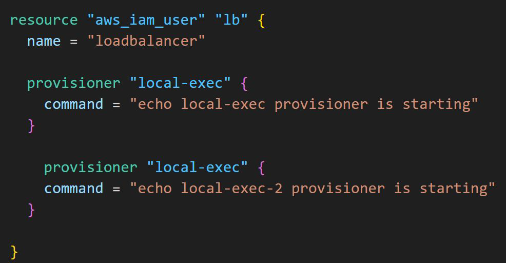

# Points to Note - Provisioners

## Provisioners are Defined inside Resource Block

It is not necessary to define a aws_instance resource block for provisioner to
run. They can be defined inside other resource types as well.

## Multiple Provisioners Blocks for Single Resource

We can define multiple provisioners block in a single resource block.

