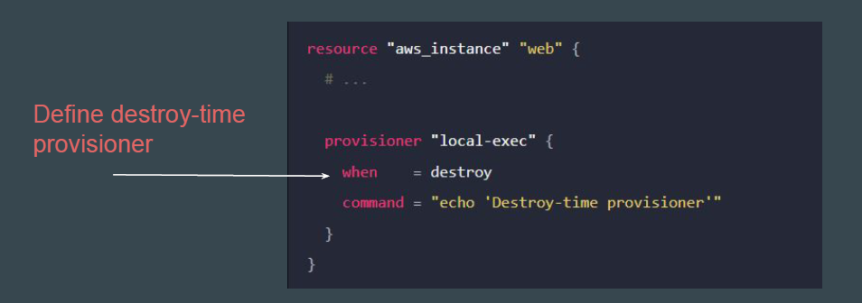
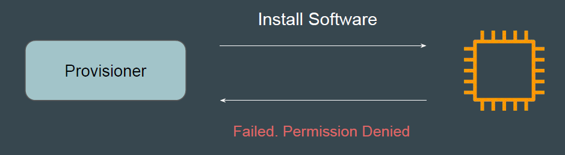
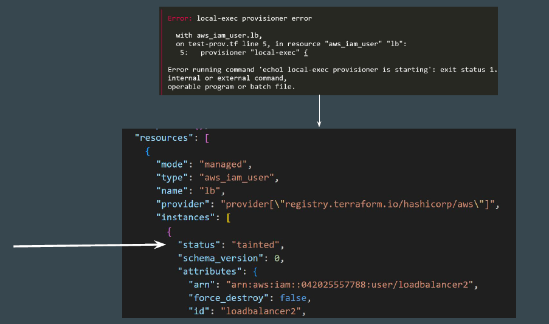

## Basic of Creation-Time Provisioners

By default, provisioners run when the resource they are defined within is
created.
Creation-time provisioners are only run during creation, not during updating or
any other lifecycle.

Destroy provisioners are run before the resource is destroyed.
Example:
Remove and De-Link Anti-Virus software before EC2 gets terminated.

## Tainting Resource in Creation-Time Provisioners

If a creation-time provisioner fails, the resource is marked as tainted.
A tainted resource will be planned for destruction and recreation upon the next
terraform apply.
Terraform does this because a failed provisioner can leave a resource in a
semi-configured state.

## Reference Screenshot - Resource Marked as Tainted

Following screenshot shows state file that has marked the resource as “tainted”
because the provisioner had failed.

