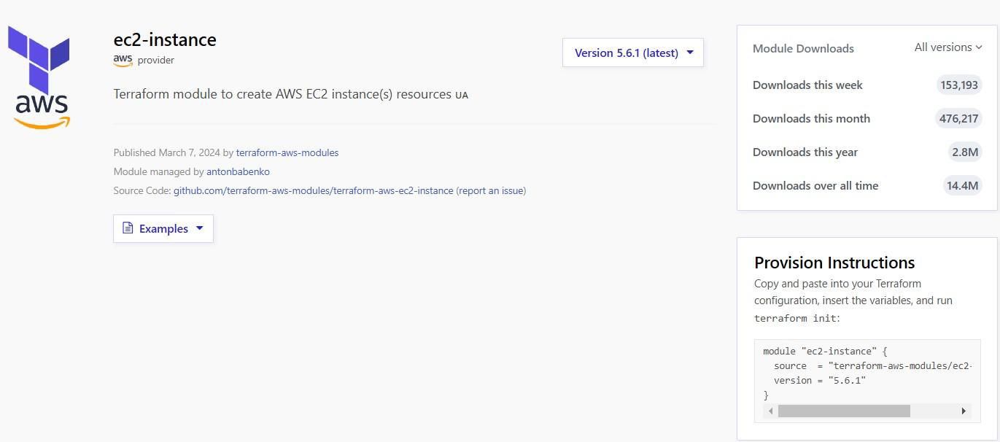
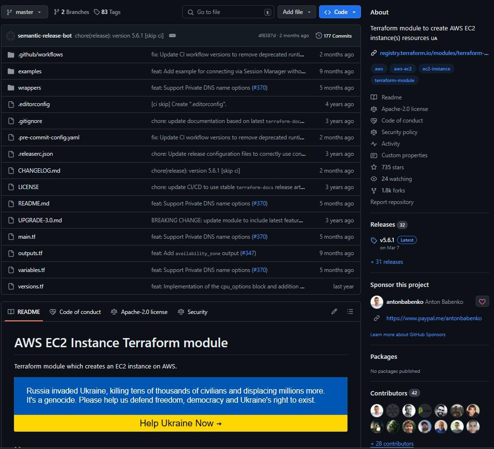
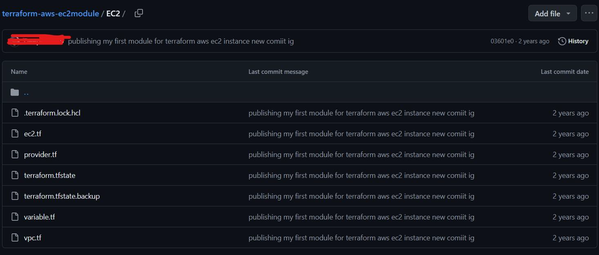
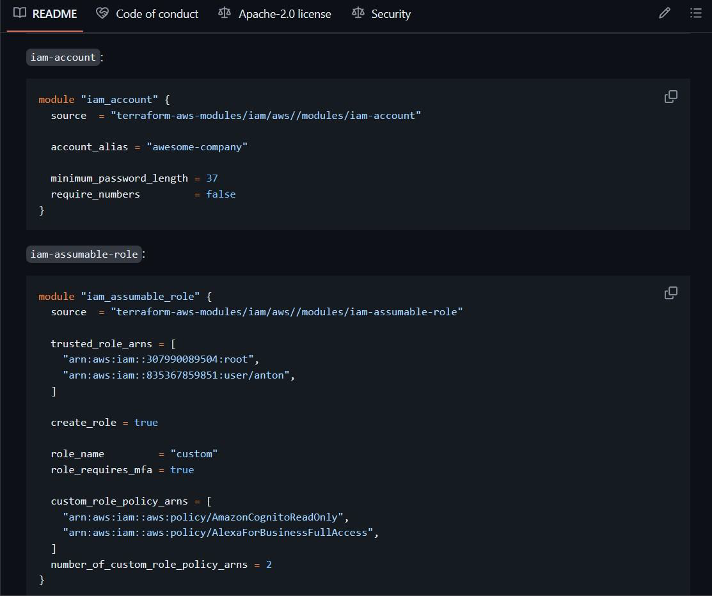
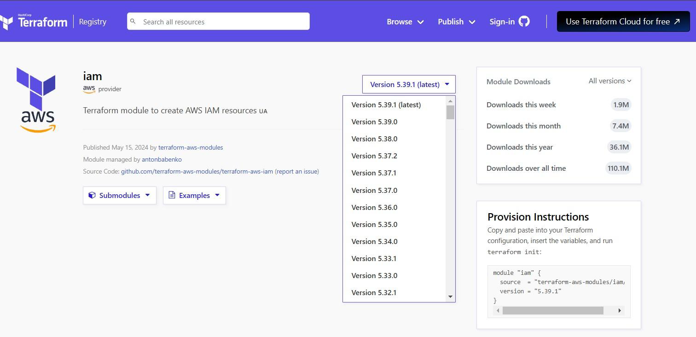
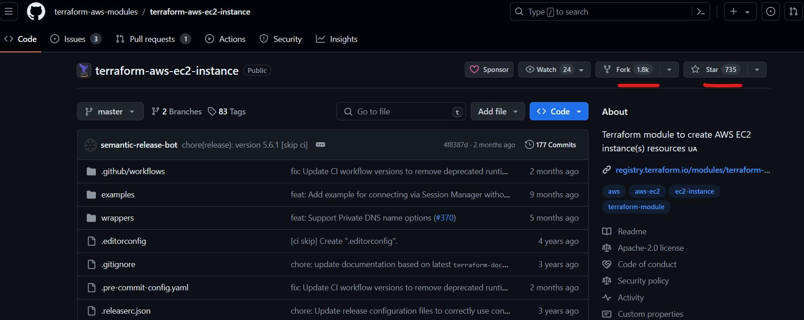
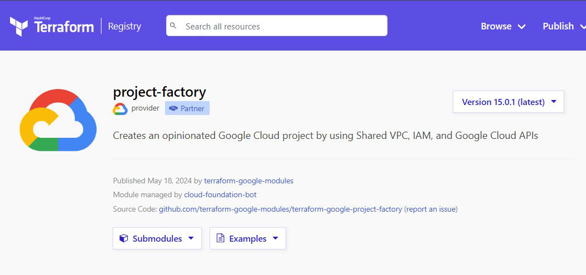

# Choosing the Right Terraform Module

Terraform Registry can contain multiple modules for a specific infrastructure
resource maintained by different users

## 1 - Check Total Downloads

Module Downloads can provide early indication about level of acceptance by
users in the Terraform community

## 2 - Check GitHub Page of Module

GitHub page can provide important information related to the Contributors,
Reported Issues and other data.

## 3 - Avoid Modules Written by Individual Participant

Avoid module that are maintained by a single contributor as regular updates,
issues and other areas might not always be maintained.

## 4 - Analyze Module Documentation

Good documentation should include an overview, usage instructions, input and
output variables, and examples.

## 5 - Check Version History of Module

Look at the version history. Frequent updates and a clear versioning strategy
suggest active maintenance.

## 6 - Analyze the Code

Inspect the module's source code on GitHub or another platform. Clean,
well-structured code is a good sign.

## 7 - Check the Community Feedback

The number of stars and forks on GitHub can indicate popularity and community
interest.

## 8 - Modules Maintained by HashiCorp Partner

Search for modules that are maintained by HashiCorp Partners

## Important Point to Note

Avoid directly trying any random Terraform module that is not actively maintained
and looks shady (primarily by sole individual contributors)
An attacker can include malicious code in a module that sends information about
your environment to the attacker.

## Which Modules do Organizations Use?

In most of the scenarios, organizations maintain their own set of modules.
They might initially fork a module from the Terraform registry and modify it based
on their use case.