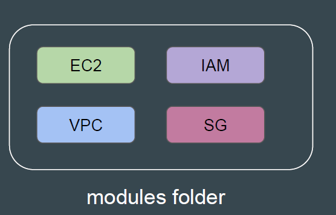
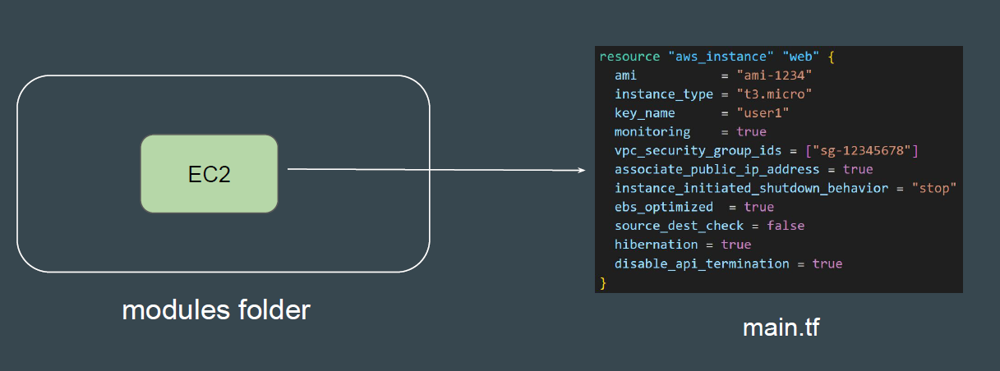
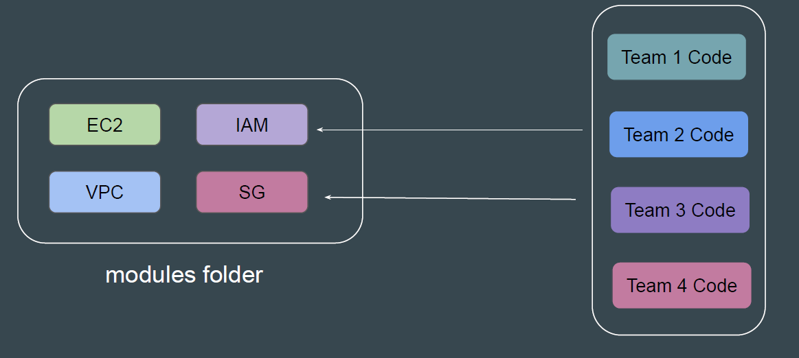
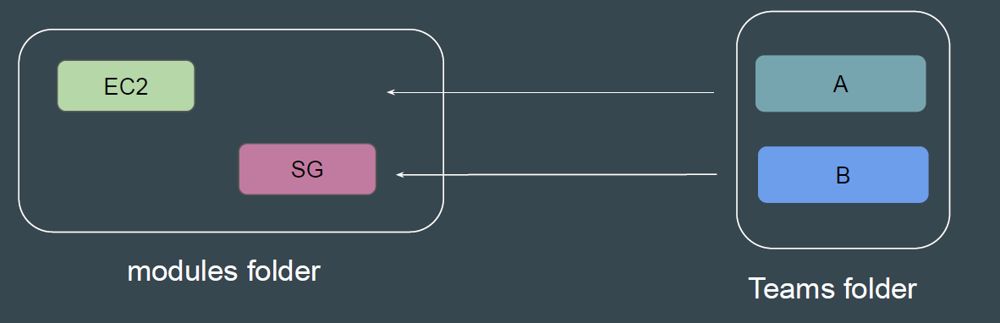

# Creating Base Module Structure

## Understanding the Base Structure

A base “modules” folder.
A sub-folder containing name for each modules that are available.

## What is Inside the Sub-Folders

Each module’s sub-folder contains the actual module Terraform code that other
projects can reference from.

## Calling the Module

Each Team can call various set of modules that are available in the modules
folder based on their requirements.

## Our Practical Structure

Our practical structure will include two main folders (modules and teams).
Modules sub-folder will contain sub-folders of modules that are available.
Teams sub-folder will contain list of teams that we want to be made available.

