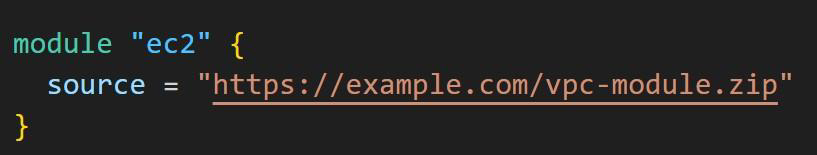
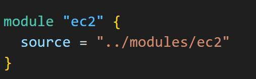
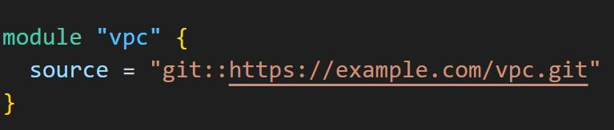
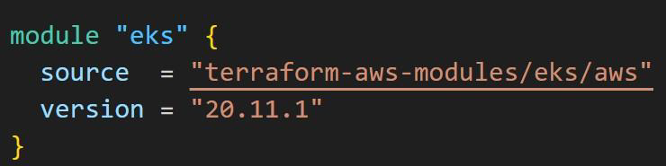

# Module Sources - Calling a Module

Module source code can be present in wide variety of locations.
These includes:

1. GitHub
2. HTTP URLs
3. S3 Buckets
4. Terraform Registry
5. Local paths

## Base - Calling the Module

In order to reference to a module, you need to make use of module block
The module block must contain source argument that contains location to the
referenced module.

## Example 1 - Local Paths

Local paths are used to reference to module that is available in local filesystem.
A local path must begin with either ./ or ../ to indicate that a local path

## Example 2 - Generic Git Repository

Arbitrary Git repositories can be used by prefixing the address with the special
git:: prefix.

## Module Version

A specific module can have multiple versions.
You can reference to specific version of module with the version block

https://developer.hashicorp.com/terraform/language/modules/sources